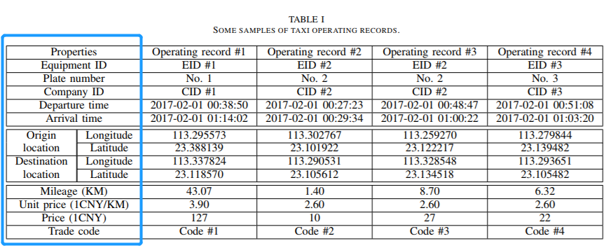
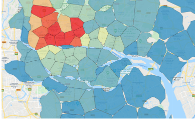
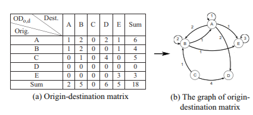
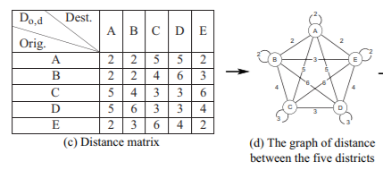
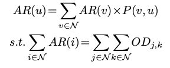
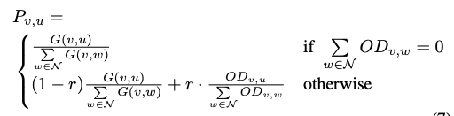
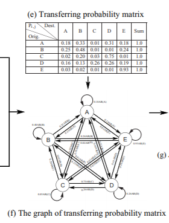
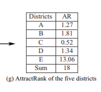
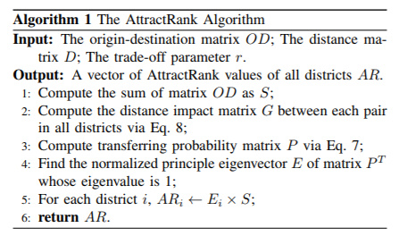
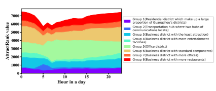

## 《AttractRank: District Attraction Ranking Analysis B ased on Taxi Big Data》

### 当前现状
传统的城市规划方法大都基于改地区的GDP，就业率，人口密度，调查问卷等等。然而随着城市数据的爆炸式增长，以上这些信息的信息量相对较少。当前已经有一些基于PageRank的扩展方法，如 Geographic PageRank，但它们没有充分利用OD信息（origin-destination，出发地-目的地的数据对），计算出来的地区排名信息只独立代表一个地区的吸引力而忽视地区间的相互影响。

由此，本文作者提出一个叫“AttractRank”的算法，利用出租车的经纬度点集建立OD矩阵和距离矩阵以此来计算每个地区的吸引力排名。

### 研究方法

作者收集的广州出租车出行数据如下图：

其中每列代表一条样本，最左边一列是每个样本的属性说明。
在59天内一共11,175,138条数据。

##### 数据处理
1. 将经纬度坐标通过Mercator投影，转变为平面坐标（以便于绘图）

2. 利用Constrained K-means方法，用这些数据将广州市行政区域地图分为90个类别，最后归类为134个“地区”：

3. 生成OD矩阵，矩阵的每个元素$O D_{i,j}$代表每小时内从出发地i区到目的地j区的出租车运营次数：

4. 生成距离矩阵，$D_{i,j}$表示地区i到地区j的距离：

##### 吸引力值的计算（AttractRank算法）
* 关键公式：
计算地区u的吸引力值AR(u)

其中

为从地区v到地区u的出行概率（转移概率）:

而其中
$$
G(v, u)=\frac{1}{D_{v, u}}
$$

由此，可以得到一系列的关于AR(地区1)，AR(地区2)，..., AR(地区n)的方程，再结合约束条件：
$\sum_{i \in \mathcal{N}} A R(i)=\sum_{j \in \mathcal{N}} \sum_{k \in \mathcal{N}} O D_{j, k}$
，解此方程组，即可得每个AR的值：

* 算法过程（用了矩阵特征值的方法）：

### 结论
##### AttractRank是存在并且唯一
作者利用了马尔科夫链的一个重要理论：对于非周期、不可约、正常返的马尔可夫链极限分布就是该马尔可夫链的唯一平稳分布，说明计算出来的AR值向量是收敛的：

$\pi_{A R}=\left(\sum_{i \in N} \sum_{j \in \mathcal{N}} O D_{i, j}\right) \pi_{u}$，
其中，$\pi_{A R}$是AR吸引力值的向量，$\pi_{u}$是其平稳状态

##### AttractRank的意义
它能够预测出城市每个地区的人流及未来影响趋势，这是在智慧城市计算中发挥重要作用的。作者最后给出基于时间流的广州每个地区AR值的分布趋势：

它把每个地区的AR值分成以上8个大组，由此说明：
1. 广州地区划分为以下5个类型：居住区，交通枢纽区，商业区，办公区和商业办公混合的区域
2. 识别出广州人4个重要的时间点：火车或飞机的出行时间，打出租车上班时间，娱乐休闲时间和回家时间
3. 探索出城市节奏和生活模式：每天上午6点到下午2点是广州人的上班时间，凌晨0点迎来的地区吸引力值的高峰，一直到凌晨5点达到低谷，果然广州是一个不眠之城。
