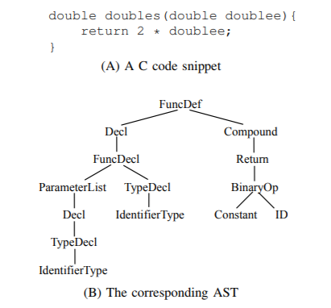
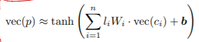
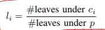
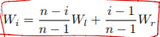
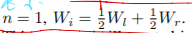
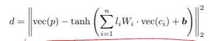

## 《Building Progream Vetor Representations for Deep Learning》 阅读报告

### 现状

* 代码不像自然语言，难以套用自然语言的方法学习特征。
1. 自然语言可以看成是按时间线维度的序列，而代码有自己的空间结构：有缩减、嵌套、分支、循环等，一般不会把代码排成一行去读。
2. 代码中空间上相邻的东西，在语义上不一定相近，这也是跟自然语言不同的地方。
3. 用深度网络学习会有梯度消失或梯度爆炸（当然，现在有很多方法解决这个问题，可能论文当时没有？）

作者要找到一种能够将代码表示为有意义的向量的方法

### 研究方法

1. 考虑要表示的粒度。

* 字符级别的粒度。不合适。如double和doubles，在自然语言里，它们应该是相似的表示，但在代码里，double可以表示变量类型，doubles可以表示为方法名，明显意义不同。
* 单词token级别的粒度。也不合适。首先，相似的token可能会很多，如方法名func1，func2，func3，....。因此会产生无穷多的token。其次，可能会使数据出现严重倾斜（某些样本的数量会极少）
* AST结点的粒度。AST可以反映一段的结构：

而且，结点的类型也是有限的，似乎挺合适映射为向量表示一段代码。但它也是缺点：结点的表示过于抽象，如无法区分类似a * b和c * d的语句，标识符都是一样的表示。

* 语句粒度，函数粒度或更高的粒度。理论上它们都可以映射为实值向量，但这种表示不能直接用于训练。（why?）

基于综合衡量，最终还是选定用AST的结点作为代码的表示。

2. 模型推导

表示学习最基本的一点是相似的特征具有相似的表示。在代码里，可以将特征相似等价为代码具有相似的功能或用途。如ID和Constant相似，因为它们都跟数据引用相关。再如For和While它们也相似，都用于表示循环的代码片段。
为了表达这种相似性，将AST的每个结点用其孩子的表示来编码，vec(x)表示结点x的向量（例如有30维）。如结点p和其直接子节点c1,c2,c3,...,cn，则结点p表示为（相当与一个单层的神经网络）：

Wi大小30x30的ci的权重矩阵，b是30维的偏置向量，而Wi的权重li是由ci下的叶子数决定的:

但AST的结点可能有不同数量的子结点，所以Wi的数量不太好确定。为避免权重矩阵数量过多，于是利用一种叫连续二叉树的模型，不管结点有多少子结点，都将其看成一颗二叉树。模型中只有Wl和Wr两个权重矩阵（左右子树），Wi就是Wl和Wr的线性组合。如结点p包含n>=2个子结点，则对于p的某个子结点ci，

若n=1，则：

于是，结点的位置信息就能编码到网络中。

于是得到计算向量间相似度的欧氏距离：

理论上距离越小越好，但不能直接对d最小化，例如得到vec(x) = 0, W = 0, b = 0也毫无意义。于是，引入负采样。对于每一个训练样本x，从其中随机选择一个特征（p，c1，c2，c3，...，cn），把它替换为随机的一个特征来生成负样本xc，那么用负样本计算的欧氏距离dc至少是d + delta那么大（delta通常设为1），得到损失函数如下：

最后，为了防止过拟合，加上l2正则化项，最终得到优化目标为：

其中 M = 2 * 向量维度的平方

3. 训练过程

1) 随机初始化模型参数 （vec(x), Wl, Wr，b）

2) 对于每一个训练样本和负样本，计算目标函数的值

3) 使用带动量的梯度下降法更新参数，直到模型收敛

### 研究结果

使用这些预训练好的代表代码的向量，进行聚类和监督学习，都有优秀的效果：

聚类正确：

监督学习曲线，随机初始化权重与使用预训练好的权重对比：

