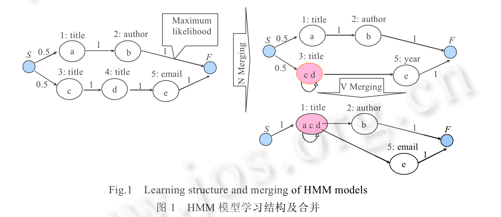
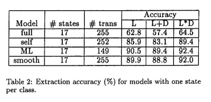
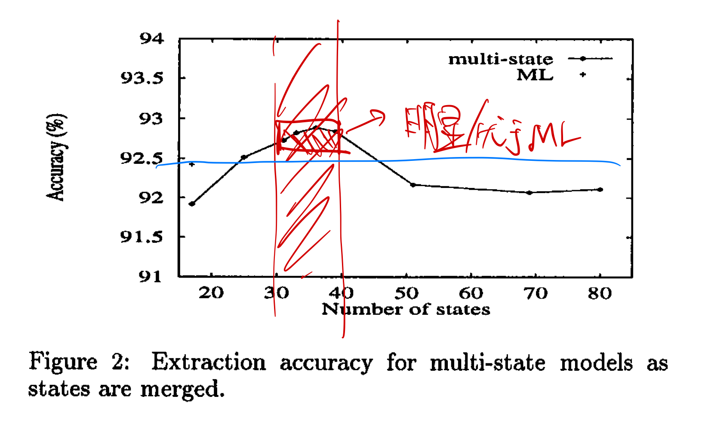
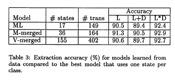
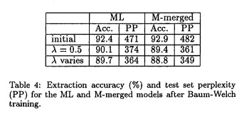

## 《Learning Hidden Markov Model Structure for information Extraction》阅读报告

### 研究现状

目前学习HMM的一个问题是，人工指定的成分比较多，人工指定一种状态对应一个类别，而没有从数据出发学习模型的结构。
作者以挖掘计算机科学研究论文的头部信息为例（Header），阐述其对学习HMM的做出的两种改进：

1. 相对于一个状态对应一个类别，作者使用多个状态对应一个类别；

2. 增加使用distantly-labeled的数据进行学习

### 研究方法

1. 什么是多个状态对应一个类别？

训练数据中的每个单词都赋予一个状态，那么单词与其下一个单词就会有个一个状态之间的转移，然后使用“neighbor-merging”将横向上具有相同类别的状态进行合并，并且使用“V-merging”将纵向上将相同类别的状态也进行合并，具体操作如图：

（图片引用自张铭、银平、邓志鸿、杨冬青的《SVM+BiHMM: 基于统计方法的元数据抽取混合模型》）

那么，虽然从图看上去是一个状态对应一个类别，但其实该状态里面是包含多个相同或相似的类别，当然，这个合并后的状态也会有一个转移指回自身。

2. 训练数据的改进

这里训练HMM有三种类型的数据：

* 带标记的数据

配合贝叶斯定理：

$$
\begin{aligned}
\hat{\mathrm{P}}\left(q \rightarrow q^{\prime}\right) &=\frac{c\left(q \rightarrow q^{\prime}\right)}{\sum_{s \in Q} c(q \rightarrow s)}
\end{aligned}
$$

$$
\begin{aligned}
\hat{\mathrm{P}}(q \uparrow \sigma) &=\frac{c(q \uparrow \sigma)}{\sum_{\rho \in \mathcal{D}} c(q \uparrow \rho)}
\end{aligned}
$$

只需要用监督学习的方法即可.

* 不带标记的数据

使用Baum-Welch算法。

* distantly-labled的数据

这是一些不是用来训练自身HMM的数据，是其他领域的已经标注的数据，也有相关性。譬如BibTex文件就包含一些已经标注好所引用文献的作者、标题等Header信息。这些数据也可用来训练自身HMM的发射概率分布。

### 研究结论

首先比较用传统方法+不同训练数据训练HMM的结果：

说明：
模型种类方面：
* full模型：一个全连接图的HMM，每个连接的概率（转移概率）为均匀分布
* self模型：状态自身到自身的转移概率是根据最大似然估计得来，其他不同状态的转移概率为均匀分布
* ML模型：所有状态间（包括自身到自身）的转移概率都是最大似然估计的概率
* smooth模型：在ML模型基础上做平滑，保证有非零的转移概率

数据方面：
* L：只用带标记的数据训练
* L+D：将带标记的数据和Distantly-labled数据进行简单的拼接组合成的数据进行训练
* L*D：分别将用带标记数据进行训练的结果和用Distantly-labled数据进行训练的结果进行插值，最后得出总的结果。

可见各个模型用L*D方式训练的结果是最优的。

然后，进行多状态的模型跟ML模型的对比：

蓝线表示传统ML模型的平均准确率

而折现代表多状态模型随状态数量变化，其训练精确度的趋势。可见在状态数量30~40这个区间，精确率总体比ML模型高，在数量为36时达到最高。

另外还有使用M-merging和V-merging进行状态合并后的模型跟ML模型的数据对比，都反应了这种多状态模型具有较高的训练精确率：

最后，作者希望在以下方面作出更多的研究：

1. 使用贝叶斯模型Merging。
2. 增加更多的头部特征信息，譬如单词的位置信息。
3. 为内部状态建模，以便更好的挖掘到状态前后的若干个单词信息。

附：
* 论文链接：[https://www.aaai.org/Papers/Workshops/1999/WS-99-11/WS99-11-007.pdf](https://www.aaai.org/Papers/Workshops/1999/WS-99-11/WS99-11-007.pdf)
