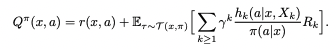

##  《Hindsight credit assignment》阅读报告

### 研究现状

本文主要考虑的问题是：如何在状态x下选择一个影响未来的行为a?
目前的问题主要有：
1.估计值函数的方式只是简单的求回报的平均，这种蒙特卡洛式的估计很低效；
2.基于马尔科夫假设的估计有偏差：状态只是部分可观测
3.跟时间步相关性强：离当前越近的行为，获得的奖励或惩罚影响就越大？ 
4.估计这个行为的价值只使用了状态-行为序列中发生的这个行为，而我们希望要用上所有相关的行为。

目标：We propose to learn estimators that explicitly consider the credit assignment question: "given an outcome, how relevant were past decisions?"，智能体得到实质性奖励后，再分配到经历过的每一个（st, at）上

### 研究方法

##### 引入基于状态的后知分布（State-conditional hindsight distributions）:

$h_k(a|x, \pi, y)=P_{\iota \sim \tau(x, \pi)}(A_0 = a | X_k = y)$

表示当状态-行为序列基于策略$\pi$时，第k个时间步状态为y而序列中第一个行为为a的概率。它可以表示行为a跟未来状态y的相关性：
不相关，则策略依旧为$\pi(a|x)$
如果a导致y发生，则$h_k(a|x, \pi, y) > \pi(a|x)$
如果a不利于y的发生，则$h_k(a|x, \pi, y) < \pi(a|x)$
那么，基于贝叶斯定理，有：
$$
h_k(a|x, \pi, y) 
\\= P_{\iota \sim \tau(x, \pi)}(A_0 = a | X_k = y) 
\\=P(A_0=a|X_k=y, X_0=x, \pi) 
\\=\frac{P(A_0=a, X_k=y, X_0=x, \pi)}{P(X_k=y, X_0=x, \pi)} 
\\ = \frac{P(X_k=y | A_0 = a, X_0=x, \pi) P(A_0=a,X_0=x,\pi)}{P(X_k=y, X_0=x, \pi)} 
\\ = \frac{P(X_k=y | A_0 = a, X_0=x, \pi) P(A_0=a|X_0=x,\pi)P(X_0=x, \pi)}{P(X_k=y, X_0=x, \pi)} 
\\ = \frac{P(X_k=y | A_0 = a, X_0=x, \pi) P(A_0=a|X_0=x,\pi)}{P(X_k=y|X_0=x, \pi)} 
\\= \frac{P_{\iota \sim \tau(x, a, \pi)}(X_k=y) \pi(a|x)}{P_{\iota \sim \tau(x, \pi)}(X_k=y)}
$$

所以：
$$
\frac{h_k(a|x, \pi, y)}{\pi(a|x)} = \frac{P_{\iota \sim \tau(x, a, \pi)}(X_k=y)}{P_{\iota \sim \tau(x, \pi)}(X_k=y)}
$$

那么，这个比值就可以量化行为a与状态$X_k$的相关度:
比值为1时，表示当前行为$A_0=a$对状态转移到$X_k=y$不相关;
比值越大，表示当前行为$A_0=a$对状态转移到$X_k=y$贡献越大

更新后的价值函数：

优势函数：

使用这个比值对累积奖励进行加权，则重要性越大的行为，得到的奖励越被重视。

由此来减少估计的偏差。

而且，为了去除对时间的依赖，将$h_k$改写为$h_\beta, \beta \in [0, 1)$表示在每个时间步的“probability of survival”（hoho: what????），它可以是折扣因子$\gamma$，或终结概率。

这个概率$h_\beta(a|x, X_k)$通过cross-entropy loss进行训练，大概思想为：输入未来状态$X_k$和当前状态$X_0$的向量到神经网络，输出行为的概率，然后和真实的动作$A_0$作cross-entropy。

##### 基于回报的后知分布

$h_z(a|x, \pi, z)=P_{\iota \sim \tau(x, \pi)}(A_0 = a | Z(\iota) = z)$

类似基于状态的后知分布，$h_z$衡量了当前行为a对未来回报的影响程度。

相应的V函数：

优势函数：

注意：这里使用$c(a|x, Z)=1-\frac{\pi(a|x)}{h_z(a|x,z)}$表示行为a对获得z回报的贡献程度：
c(a|x, Z) = 0，则表示a跟其他行为（用$\pi(·|x)$衡量）回报相同
c(a|x, Z) > 0，表示a贡献更大
c(a|x, Z) < 0, 表示a贡献更小

### 研究结论

### 附

##### 论文链接：[https://arxiv.org/pdf/1912.02503.pdf](https://arxiv.org/pdf/1912.02503.pdf)

##### 新词解析

* off-policy
* on-policy
* trajectory: 轨迹，即一段状态-动作序列
* advantage function: 在状态s下，某动作a相对于平均而言的优势：
$A^\pi(s, a)=Q^\pi(s, a) - V^\pi(s)$
* actor-critic algorithm
* aliased chain
* noisy reward
* policy gradient