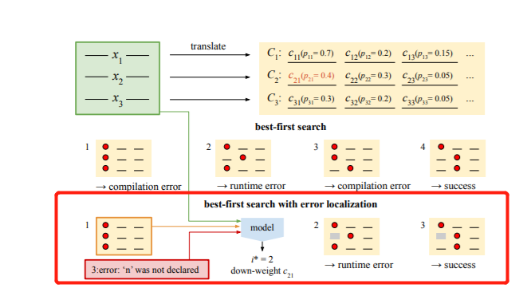

## 《SPoc-Search-based Pseudocode to Code》阅读报告

### 研究现状

当今自动生成代码的方法只注重句法正确性的度量，而忽视功能上的正确性

### 研究目标

不同于只使用预测概率最高的生成代码，本文提出一种在搜索空间中寻找可能的能通过测试用例的生成代码。

* 输入：一行行的伪代码（每行包含缩进水平）和公开的测试用例
* 输出：每行对应的真实代码，并让整个程序通过公开和隐藏的测试用例

总流程如图：

### 研究方法

训练集结构如下：
* 伪代码行：x1, x2, x3, ..., xL
* 对应真实代码行：y1, y2, y3, ..., yL
* 公开测试用例：(T1_in, T1_out), (T2_in, T2_out), ..., (Tk_in, Tk_out)
* 隐藏测试用例：(Th1_in, Th1_out), (Th2_in, Th2_out), ..., (Thk_in, Thk_out)

测试集结构如下:

* 伪代码行x
* 公开测试用例

测试时会设置一个最大尝试阈值（computation budget）,每次尝试时会将生成好的程序用公开测试用例测试。

主要思想为：

1. 输入（xi, yi）对，其中伪代码为xi（一行），yi为对应的真实正确的代码（一行），使用seq2seq+Attention模型，将伪代码xi编码，
2. 使用beam search，设置一个beam size = M，模型将伪代码xi“翻译”为M个候选的代码集Ci，每个代码行cij会有被模型赋予条件概率p_ij = p(cij | xi)，那么对于L行伪代码x，会形成L个候选代码集C，每个代集中会含有M个候选代码，并将每个候选代码集中的候选代码按p_ij由大到小排列
3. Best-first search：逐行选择p_ij最高的代码，组装成程序后，使用测试用例进行测试，所期间发生编译错误、运行期错误或测试用例不通过，则用下一个高p_ij的候选代码代替，重新执行测试用例。或直到达到最大尝试阈值。

但使用best-first search效率很低。本文提出另外一种基于error localization的搜索后续代码的方法：

当出现编译错误时（作者只考虑编译错误，认为88.7%的代码错误都是编译错误），编译器会告诉出错代码行号i_err和出错信息m_err，然后根据(i_err, m_err)定位出错的真正行号，降低此行候选代码被搜到的权重或直接拉入黑名单（不在搜索）。具体又分为两种实现方法：

* 多分类方法（Multiclass classification）
主要用于预测具体出错的代码行i*，如下图所示。

1. 对于每行i，将伪代码xi，和真实代码yi，以及m_err编码，然后分别用三个独立的LSTM训练
2. 将每个LSTM最后输出的隐藏状态拼接起来。
3. 计算delta_i = i_err - i，使用位置编码（具体参考“Attention is all you need”）将其编码，再将其拼接在2步的后面，形成行i整体的嵌入。
4. 将3步的行嵌入输入到另一个LSTM，其输出的隐藏状态再通过一个全连接神经网络进行训练，得到预测的行i*，若预测概率高于95%（超参），则接受i*，否则抛弃
5. 得到i*，将i*行相应的候选代码降权：将其概率p_ij乘以一个小于1的数（超参），以减低其被搜索的概率

* 预剪枝（Prefix-based pruning）

    只尝试编译器告知的出错行的前0、1、2行，找到最小出错的行数，最后将从第一行到此行的候选代码都抛弃掉。（本文认为包含出错行之前的行通常都会使程序不通过）

### 研究结论

* 对每个程序，每行代码都用概率最高的候选代码组装时，不正确的代码行数占比：

    

    其中测试集TestP为根据程序所属问题的分类来划分的。而测试集TestW是用过人工划分。

    可见，只有TestP只有18.2%，TestW只有32.0%在使用最高概率候选时，没有一行代码出错。

* 对每个程序，在每个候选集（Ci）里，没有任何正确候选的代码行数占比：

    

    可见，在TestP中至少有1行代码找不到任何候选的占比为44.8%，而在TestW中是28.6%。这说明生成可运行程序的最大成功率，在TestP中为55.2%，在TestP中为71.4%

* 含有Error localization和不含Erro localization的搜索方法对比：

    

### 启发

1. 生成代码需要有多个候选，保证程序的完备性（可正确运行）
2. 需要提供测试用例一起加入训练
3. 为提高生成候选代码的正确率，应更多的考虑程序的语义，譬如基于AST结构进行编码，而不仅仅像本文所说只是将整行代码按字符流顺序编码

### 附：

* 文献链接：[https://arxiv.org/abs/1906.04908](https://arxiv.org/abs/1906.04908)

* 数据集：[https://sumith1896.github.io/spoc/](https://sumith1896.github.io/spoc/)