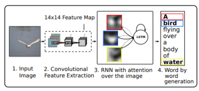
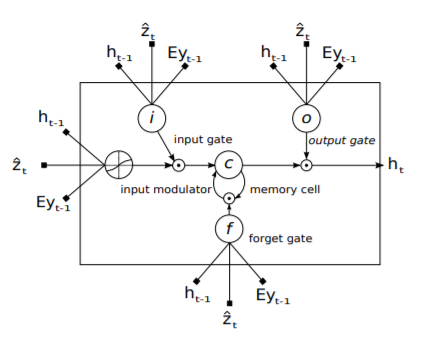
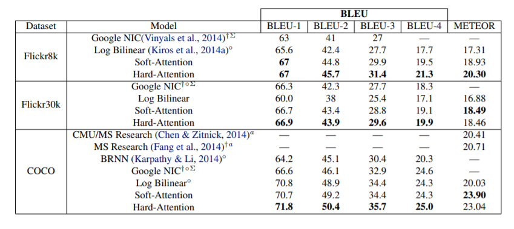

## 《Show, Attend and Tell: Neural Image Caption Generation with Visual Attention》阅读报告

### 研究现状
图片摘要生成是计算机图形识别基本的一环。目前现有方法也是基于encoder-decoder架构。encoder使用一系列的CNN组合对图像进行特征提取，提取出来的特征向量输入到基于RNN的decoder，RNN对其解码并生成句子。

另外，在神经网络之前，还有两种方法：
1. 生成摘要模板，填入一些图像物体检测和属性发掘到的物体；
2. 从大型的数据库里检索图像的相似摘要，然后修改修改这些摘要以便查询；

这两种方法都使用一种泛化手段，是的描述跟图像很接近，但又不是很准确。于是，作者提出两种基于注意力的图片摘要生成方法：hard attention和soft attention。

作者的模型总体架构如下：

### 研究方法

#### encoder

句子摘要以一个K维序列表示：

$y=\left\{\mathbf{y}_{1}, \ldots, \mathbf{y}_{C}\right\}, \mathbf{y}_{i} \in \mathbb{R}^{K}$

使用CNN提取L个D维的标记向量，每个向量对应图像的一个区域：

$a=\left\{\mathbf{a}_{1}, \ldots, \mathbf{a}_{L}\right\}, \mathbf{a}_{i} \in \mathbb{R}^{D}$

区别于多数CNN提取特征最后一层使用全连接层，作者使用low-level的卷积层代替全连接层。那么，decoder可以通过选择所输入的特征向量的一部分，找到对应的图像的一部分。注意力就是这么来的。

#### decoder

decoder使用了LSTM，基于上下文向量一个个单词的生成摘要。相比传统LSTM的输入，它多了一个$\hat{\mathbf{z}} \in \mathbb{R}^{D}$向量，如图：

向量z就是一个上下文向量（context vector），它捕捉图像上特定位置的信息，注意力机制也就在这里体现了。

LSTM各向量的计算方式为：

$\left(\begin{array}{c}\mathbf{i}_{t} \\ \mathbf{f}_{t} \\ \mathbf{o}_{t} \\ \mathbf{g}_{t}\end{array}\right)=\left(\begin{array}{c}\sigma \\ \sigma \\ \sigma \\ \tanh \end{array}\right) T_{D+m+n, n}\left(\begin{array}{c}\mathbf{E} \mathbf{y}_{t-1} \\ \mathbf{h}_{t-1} \\ \mathbf{z}_{t}\end{array}\right)$
$\mathbf{c}_{t}=\mathbf{f}_{t} \odot \mathbf{c}_{t-1}+\mathbf{i}_{t} \odot \mathbf{g}_{t}$
$\mathbf{h}_{t}=\mathbf{o}_{t} \odot \tanh \left(\mathbf{c}_{t}\right)$

其中 $\mathbf{h}_{t-1}$ 是上一时刻的隐藏状态，T是一个简单的仿射变换，E是Embedding矩阵。

c和h的初值分别为：

$\begin{aligned} \mathrm{c}_{0} &=f_{\text {init, }}\left(\frac{1}{L} \sum_{i}^{L} \mathbf{a}_{i}\right) \\ \mathbf{h}_{0} &=f_{\text {inith }}\left(\frac{1}{L} \sum_{i}^{L} \mathbf{a}_{i}\right) \end{aligned}$

既然z是一个上下文向量，每个时刻t，它都动态的表示出图像相应的部分，那么它就要整合encoder中图像的标记向量$\mathbf{a}_{i}$和隐藏状态$\mathbf{h}_{t-1}$

如何做？

对于图像的每个位置i，对应的生成一个权重$\alpha_{i}$，它表示生成摘要下一个单词的时候位置i是真正需要关注的概率，它可以通过一个多层感知机计算：

$\begin{aligned} e_{t i} &=f_{\operatorname{att}}\left(\mathbf{a}_{i}, \mathbf{h}_{t-1}\right) \\ \alpha_{t i} &=\frac{\exp \left(e_{t i}\right)}{\sum_{k=1}^{L} \exp \left(e_{t k}\right)} \end{aligned}$

然后，就可以计算向量z了：

$\hat{\mathbf{z}}_{t}=\phi\left(\left\{\mathbf{a}_{i}\right\},\left\{\alpha_{i}\right\}\right)$

其中$\phi$是一个函数，它的不同实现对应着hard attention和soft attention机制。

每个时刻t，最终输出的单词概率分布大致如下：

$p\left(\mathbf{y}_{t} \mid \mathbf{a}, \mathbf{y}_{1}^{t-1}\right) \propto \exp \left(\mathbf{L}_{o}\left(\mathbf{E y}_{t-1}+\mathbf{L}_{h} \mathbf{h}_{t}+\mathbf{L}_{z} \hat{\mathbf{z}}_{t}\right)\right)$

其中，$\mathbf{L}_{o} \in \mathbb{R}^{K \times m}, \mathbf{L}_{h} \in \mathbb{R}^{m \times n}, \mathbf{L}_{z} \in \mathbb{R}^{m \times D}$

#### 随机 hard attention

hard机制引入一个0-1位置变量$s_{t, i}$，t表示每一个时刻t，当第i个位置（从L个像素中）确是用来提取出图像特征，则为1，求法为：

$p\left(s_{t, i}=1 \mid s_{j<t}, \mathbf{a}\right)=\alpha_{t, i}$

那么，向量z可以这样求：

\hat{\mathbf{z}}_{t}=\sum_{i} s_{t, i} \mathbf{a}_{i}

之后的训练使用极大似然估计，然而真实分布$p(\mathbf{y} \mid \mathbf{a})$并不知道（只有训练样本点的分布$\left.p\left(\mathbf{y}_{t} \mid \mathbf{a}, \mathbf{y}_{1}, \ldots, \mathbf{y}_{t-1}\right)\right)$），于是采用了变分自编码器(VAE)的思路。由于已知$s_{t}$，故将其作为隐变量，得到分布$p(\mathbf{y} \mid \mathbf{a})$对数似然函数的变分下界：

$\begin{aligned} L_{s} &=\sum_{s} p(s \mid \mathbf{a}) \log p(\mathbf{y} \mid s, \mathbf{a}) \\ & \leq \log \sum_{s} p(s \mid \mathbf{a}) p(\mathbf{y} \mid s, \mathbf{a}) \\ &=\log p(\mathbf{y} \mid \mathbf{a}) \end{aligned}$

这里使用了Jensen不等式。

然后将$L_s$作为目标函数，对各参数W求梯度：

$\begin{aligned} \frac{\partial L_{s}}{\partial W}=\sum_{s} p(s \mid \mathbf{a}) &\left[\frac{\partial \log p(\mathbf{y} \mid s, \mathbf{a})}{\partial W}+\right. &\left.\log p(\mathbf{y} \mid s, \mathbf{a}) \frac{\partial \log p(s \mid \mathbf{a})}{\partial W}\right] \end{aligned}$

对s进行多重蒙特卡洛采样，近似求梯度：

$\tilde{s}_{t} \sim \operatorname{Multinoulli}_{L}\left(\left\{\alpha_{i}\right\}\right)$
$$
\begin{array}{c}\frac{\partial L_{s}}{\partial W} \approx \frac{1}{N} \sum_{n=1}^{N}\left[\frac{\partial \log p\left(\mathbf{y} \mid \tilde{s}^{n}, \mathbf{a}\right)}{\partial W}+\right.  \left.\log p\left(\mathbf{y} \mid \vec{s}^{n}, \mathbf{a}\right) \frac{\partial \log p\left(\tilde{s}^{n} \mid \mathbf{a}\right)}{\partial W}\right]\end{array}
$$

为了减少上述估计的方差，还使用了移动平均线的方法：

$b_{k}=0.9 \times b_{k-1}+0.1 \times \log p\left(\mathbf{y} \mid \tilde{s}_{k}, \mathbf{a}\right)$

而且，进一步引入多元伯努利分布的熵作优化。最终得到的梯度计算式为：

$\frac{\partial L_{s}}{\partial W} \approx \frac{1}{N} \sum_{n=1}^{N}\left[\frac{\partial \log p\left(\mathbf{y} \mid z^{n}, \mathbf{a}\right)}{\partial W}+\right.$$\left.\lambda_{r}\left(\log p\left(\mathbf{y} \mid \tilde{s}^{n}, \mathbf{a}\right)-b\right) \frac{\partial \log p\left(\bar{s}^{n} \mid \mathbf{a}\right)}{\partial W}+\lambda_{e} \frac{\partial H\left[\hat{s}^{n}\right]}{\partial W}\right]$

其中$\lambda_r$和$\lambda_e$是两个超参数。

#### 确定性 soft attention

soft机制直接对每个$a_i$加权得到z:

$\mathbb{E}_{p\left(s_{t} \mid a\right)}\left[\hat{\mathbf{z}}_{t}\right]=\sum_{i=1}^{L} \alpha_{t, i} \mathbf{a}_{i}$

由于此时模型是连续可微的，使用标准的向后传播法训练即可。

作者还给出了归一化加权几何平均值的定义：

$\begin{aligned} N W G M\left[p\left(y_{t}=k \mid \mathbf{a}\right)\right] &=\frac{\prod_{i} \exp \left(n_{t, k, i}\right)^{p(s t, i=1 \mid a)}}{\sum_{j} \prod_{i} \exp \left(n_{t, j, i}\right)^{p\left(s_{t, i}=1 \mid a\right)}} \\ &=\frac{\exp \left(\mathbb{E}_{p\left(s_{t} \mid a\right)}\left[n_{t, k}\right]\right)}{\sum_{j} \exp \left(\mathbb{E}_{p\left(s_{t} \mid a\right)}\left[n_{t, j}\right]\right)} \end{aligned}$

该式表示生成摘要的结果可以通过文本向量很好近似，也就是生成结果有效，也表示soft机制是关于注意力位置的边缘的似然近似。

最后，作者还给出了一个提升模型性能的方法——双重随机注意力，模型应该尽量使$\sum_{t} \alpha_{t i} \approx 1$，即每一轮训练中，模型对特征都有同等的关注度。
但同时，模型对一些特定物体又要“更加注意”，所以又增加了一个控制量：
$\beta_{t}=\sigma\left(f_{\beta}\left(\mathbf{h}_{t-1}\right)\right)$

于是：

$\phi\left(\left\{\mathbf{a}_{i}\right\},\left\{\alpha_{i}\right\}\right)=\beta \sum_{i}^{L} \alpha_{i} \mathbf{a}_{i}$

得到的目标损失函数为：

$L_{d}=-\log (P(\mathbf{y} \mid \mathbf{x}))+\lambda \sum_{i}^{L}\left(1-\sum_{t}^{C} \alpha_{t i}\right)^{2}$

### 结论

训练使用了随机梯度下降+学习率适配的方式训练，其中CNN采用VGG，对数据集Fickr8k使用RMSprop方法，对Flickr30k和MS COCO数据集使用Adam方法，会有更好的性能。

对比其他图片生成摘要的方法，作者引入的注意力机制使模型比较高的得分：

附：
* 论文链接：[https://arxiv.org/pdf/1502.03044.pdf](https://arxiv.org/pdf/1502.03044.pdf)
