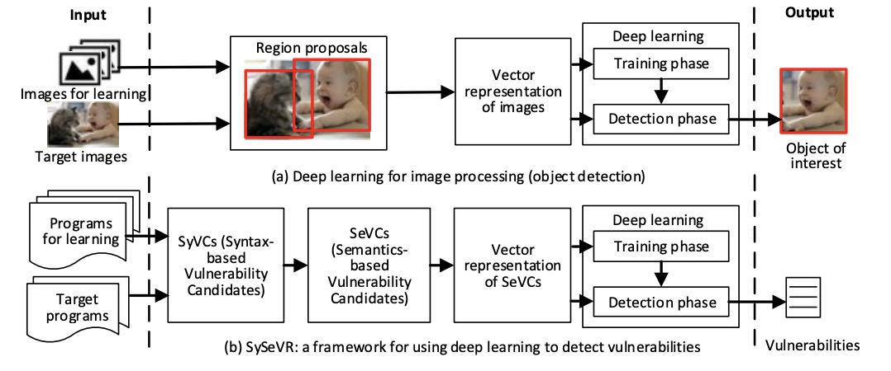

## 《SySeVR: A Framework for Using Deep Learning to Detect Software Vulnerabilities》阅读报告


### 研究现状

* 基于模式匹配的方法检测代码漏洞需要大量的人力劳动
* 现有静态分析系统普遍存在高假阴性率

而且，承接作者之前的论文《VulDeePecker: A Deep Learning-Based System for Vulnerability Detection》提到的不足：

* 只考虑与函数/API调用相关的漏洞
* 代码语义信息只利用数据间的依赖
* 只能用于BiLSTM训练学习
* 不能解析假阳性和假阴性的原因

基于以上，作者提出新的代码漏洞检测模型：SySeVC——Syntax-based, Semantics-based, and Vector Representation

### 研究目标

核心目标：根据语法和语义对代码进行特征提取，以用于漏洞检测（code2vec）


### 研究方法

受由图像识别中候选区域概念(region proposal)的启发，流程概览：



具体到漏洞检测：


整个系统是基于一个个函数/API实现进行的。

1. 提取SyVC

用静态分析工具（如Checkmatrx）生成一些漏洞语法特征（vulnerability syntax characteristics），如本文提到的4类：

* 函数/API调用（简称FC）
* 数组使用（简称AU）
* 指针使用（简称PU）
* 算术表达式（简称AE）

将程序段的每个语句转化为抽象语法树(AST)，遍历树中的每个节点，跟上述提到的各类漏洞语法特征进行“匹配”，如“匹配”成功，则认为这个节点对应的代码元素为SyVC。

譬如：

对于程序段：
```
void func()
{
    ...
    char source[100];
    source[99] = '\0';
    ...
}
```

可对应如下AST:


发现根据AU的匹配规则：
(i). 结点是一个IdentifierDeclStatement结点下的identifier
(ii). IdentifierDeclStatement结点含有“[”和“]”符号

则认为”source“是一个SyVC


========================
回顾AST:

*(from: [https://code2vec.org/](https://code2vec.org/))*

========================

2. 将SyVC转为SeVC

先定义一些概念：
* 控制流图（CFG）: 它的节点是函数语句，边表示相邻语句间的运行先后关系。
* 数据依赖（data dependency）：如果CFG中有一条A->B的路径，且在A语句中计算得到的值会在B语句中使用，则称B数据依赖A。
* 控制依赖（control dependency）：如果CFG中有一条A->B的路径，且B是否执行需要看A执行的结果, 则称B控制依赖A。
* 程序依赖图（PDG）: 它的节点与CFG中节点表示意义意义，边为表示相邻语句间的数据依赖或控制依赖
* 前向切片（forward slice）：PDG中从SyVC节点出发所有可达节点的语句集合
* 过程间前向切片（interprocedural forward slice）：包含前向切片的所有语句，以及PDG中SyVC节点通过函数调用可以到达SyVC节点的语句（很绕啊。。。。顶！）
* 后向切片（backward slice）：PDG中所有可达SyVC节点的且以该节点为终点的语句集合
* 过程间后向切片（interprocedural backward slice）：包含后向切片的所有语句，以及PDG中通过函数调用可到达SyVC节点的语句（很绕啊。。。。顶！）
* 程序切片（program slice）：过程间前向切片和过程间后向切片的语句删除其中重复的部分的组合

具体流程如下图：


* step1：已函数/API为单位生成PDG，已有标准的算法可生成PDG，具体可参考文献：[https://www.cc.gatech.edu/~harrold/6340/cs6340_fall2009/Readings/ferrante87jul.pdf](https://www.cc.gatech.edu/~harrold/6340/cs6340_fall2009/Readings/ferrante87jul.pdf)

* step2：以SyVC为”中心“，划分interprocedural forward slice和interprocedural backward slice（有哪个就划分哪个），并且每个切片可保留数据流、控制流、数据流和控制流的连接（如图中的interprocedural backward slice就只保留数据流连接），最终会导致生成的SeVC数量不同。
这里生成后向切片：7->9->10->11->13->14->16->18->22->23->24->25
和前向切片：25->26->1->3->4

* step3: 删除重复节点，整合两个切片为一个完整的程序切片，该切片即为SeVC。可见程序切片不一定是连续的程序语句。

3. 将SeVC编码为向量

操作跟VulDeepecker的类似：去掉非ASCII字符，将用户自定义的变量、用户自定义的函数转换为对应的特征符号VAR1，VAR2，FUN1，FUN2，等，将SeVC转换为符号表示。
（这里作者也提到了不同的SeVC可能会导致相同的符号表示问题。而且也交代了符号的划分是根据一定的语法分析，具体是什么也没提）

然后用word2vec，将这种符号特征一起参与训练，最后编码为向量。

4. 打标签

首先， 针对NVD数据集，若一个SeVC的diff文件包含删除或修改的语句前缀有'-'，则被标记为1，若包含的移动的语句前缀有'-'，且这个文件包含一个已知的漏洞，则被标记为1；其他情况都标记为0。
针对SARD数据集，若一个个SeVC提取自一个good程序，则被标记为0；如果提取自bad或mix程序，则分情况，若该SeVC包含至少一个漏洞语句则标记为1，否则标记为0。

然后， 使用交叉验证的方式来修正标签。将数据集分为5份，4份训练，1份验证。在验证过程中发现的假阴性样本（漏报的样本）将会被考虑是否标错，需要人工手动修正。


5. 模型训练与预测

本文作者主要使用GiGRU：


### 研究结论

#### 优点

1. 该系统能识别多类漏洞，且表现优于VulDeepecker：


2. 不依赖于特定的学习算法，但每个算法得到的效果有差异：


作者固定FPR全是2.0是因为将此时可使F1值达到最高。上图可见使用BiGRU性能最好。

3. 捕获越多的语义信息，系统检测漏洞的性能越高：


包含数据依赖和控制依赖的语义比仅包含数据依赖语义的模型，性能会更高。


4. 跟现有漏洞检测工具的对比，目前该系统性能也是最高：


#### 不足

1. 只适用C/C++代码，其他编程语言还需进一步适配
2. 使用的SARD数据学习不能反映真实的软件工程
3. 生成SyVC和SeVC的算法有待改进，以包含更多的语义
4. 仅使用一种模型来检测多种漏洞，可考虑用多模型方法检测多种漏洞
5. 只在切片级别检测漏洞，可考虑更细粒度的级别，以将漏洞准确定位到具体的代码行
6. 目前大约0.6%的样本需要人工修正，需探索更有效的自动打标签方法。


### 个人启发

1. 作者公布了新的更大的数据集：[https://github.com/SySeVR/SySeVR](https://github.com/SySeVR/SySeVR)；
2. 提出了一种有效性的code2vec方法，能捕获更多的程序间语义信息；
3. 漏洞检测的粒度还需进一步细化，以便将漏洞定位到更准确的位置；


* *附：论文链接 [https://arxiv.org/pdf/1807.06756v3.pdf](https://arxiv.org/pdf/1807.06756v3.pdf)*