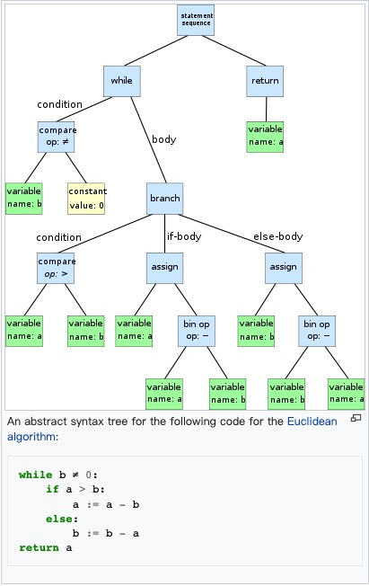

## 《VulDeePecker: A Deep Learning-Based System for Vulnerability Detection》阅读报告

### 研究现状

目前的漏洞检测（2018年）主要存在两个缺点：
1. 高度依赖人力劳动：专家知识和人工检测
2. 高的FN：目前的检测系统更看重低FP, 即更强调尽量少的误报，忽视少的漏报。 （宁可放过，也不要杀错）

回顾：

| 实际\预测  | 1 | 0 |
| :-----   | ----: | :----: |
| 1        | TP | FN |
| 0        | FP | TN |

PR(Precision Rate) = TP / (TP + FP)
RR(Recall Rate) = TP / (TP + FN)
FPR = FP / (FP + TN)
FNR = FN / (FN + TP)
F1 = 2 * PR  * RR / (PR + RR)

### 研究目标

设计一个面向源代码的自动检测漏洞系统，且同时兼顾较低FP和较低FN。

确定要解决的三个问题：

1. 将代码表示成向量
2. 选择合适的表示粒度——Code gadget
3. 用神经网络训练和预测——BiLSTM

### 研究方法

* 一些概念
1. code gadget，它由若干行语句组成，语义上有联系的语句集合（基于数据流或程序控制流的联系）
2. key point: 触发Bug的相关函数调用、数据结构等。一个bug可以对应多个key point，如缓存读写错误可以跟如下key point相关：函数调用、数组的使用、指针的使用等。一个key point也可以对应多个bug，如缓存错误和资源管理错误都由于函数调用的key point造成。

本文只关注两类bug：缓存错误和资源管理错误，

* 数据预处理（关键）

1. 从一段程序中，抽离函数/API调用，形成语义相关的程序片段（若干代码行）
    1.1 抽离函数/API调用：将函数/API分成两种类型：

    * forward: 直接从外部获得若干入参的函数/API调用。其程序段可能受外部入参影响，其漏洞可表现为外部参数的不恰当使用）。
    * backward: 非直接从外部获得若干入参的函数/API调用。其程序段会影响入参，其漏洞可表现为破坏入参。

    

    1.2 根据函数/API的参数进行程序切片：类似1.1步，划分为对应的forward slice和backward slicee，然后根据参数的数据流走向推出切片的依赖关系：

    

2. 将程序片段转为code gadget和相应ground true labels 

    2.1 重组程序切片，形成一个code gadget（不必是连续的代码行，只要代码行之间“语义相关”即可）。

    （可将跟同一个函数/API的相关的切片归并为同一个，例如将上图的4->5->9和2->9归并为2->4->5->9）：

    

    2.2 label: 1——Code gadget有漏洞，0——无漏洞，文中使用了SARD数据集[https://samate.nist.gov/SARD/](https://samate.nist.gov/SARD/)

3. 将code gadget编码为固定长度的向量

    3.1 去掉非ASCII字符，将变量、函数转换为对应的特征符号
    VAR1，VAR2，FUN1，FUN2，等。

     

    （*不知作者按什么标准定义这些符号集的，个人认为可用AST提取，
    一个AST的例子：
     
    from wiki*）
    

    3.2 将特征符号编码为向量：
    如已将函数/API代码转换为特征符号表示：

    

    分词为：

    

    (*这里作者也没详细交代怎么切分特征符号，可能还蕴含了一层word2vec预训练*)

4. 将向量输入到神经网络进行训练

    使用BiLSTM。

    

### 研究结论

数据集：将整个数据分为6个子集：

* 附：论文链接[https://arxiv.org/pdf/1801.01681.pdf](https://arxiv.org/pdf/1801.01681.pdf)