## 《VulDeePecker: A Deep Learning-Based System for Vulnerability Detection》阅读报告

### 研究现状

目前的漏洞检测（2018年）主要存在两个缺点：
1. 高度依赖人力劳动：专家知识和人工检测
2. 高FN：因为目前的静态检测系统更看重低FP, 即更强调尽量少的误报，忽视少的漏报。 （宁可放过，也不要杀错）

回顾：

| 实际\预测  | 1 | 0 |
| :-----   | ----: | :----: |
| 1        | TP | FN |
| 0        | FP | TN |

PR(Precision Rate) = TP / (TP + FP)
RR(Recall Rate) = TP / (TP + FN)
FPR = FP / (FP + TN)
FNR = FN / (FN + TP)
F1 = 2 * PR  * RR / (PR + RR)

### 研究目标

设计一个面向源代码的自动检测漏洞系统，且同时兼顾较低FP和较低FN。

确定要解决的三个问题：

1. 将代码表示成向量
2. 选择合适的表示粒度——Code gadget
3. 用神经网络训练和预测——BiLSTM

### 研究方法

* 一些概念
1. code gadget，它由若干行语句组成，语义上有联系的语句集合（基于数据流或程序控制流的联系）
2. key point: 触发Bug的相关函数调用、数据结构等。一个bug可以对应多个key point，如缓存读写错误可以跟如下key point相关：函数调用、数组的使用、指针的使用等。一个key point也可以对应多个bug，如缓存错误和资源管理错误都由于函数调用的key point造成。

本文只关注两类bug：缓存错误和资源管理错误，

* 数据预处理（关键）

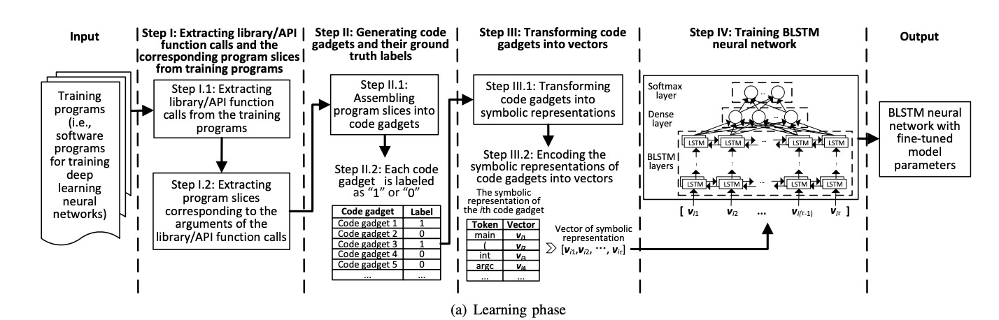

1. 从一段程序中，抽离函数/API调用，形成语义相关的程序片段（若干代码行）
    1.1 抽离函数/API调用：将函数/API分成两种类型：

    * forward: 直接从外部获得若干入参的函数/API调用。其程序段可能受外部入参影响，其漏洞可表现为外部参数的不恰当使用）。
    * backward: 非直接从外部获得若干入参的函数/API调用。其程序段会影响入参，其漏洞可表现为破坏入参。

    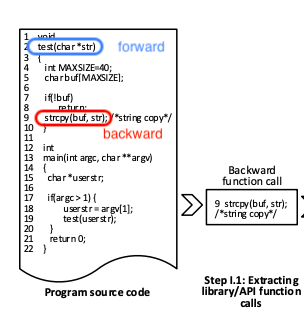

    1.2 根据函数/API的参数进行程序切片：类似1.1步，划分为对应的forward slice和backward slicee，然后根据参数的数据流走向推出切片的依赖关系：

    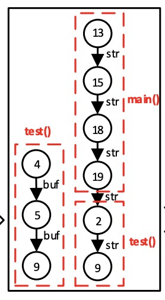

2. 将程序片段转为code gadget和相应ground true labels 

    2.1 重组程序切片，形成一个code gadget（不必是连续的代码行，只要代码行之间“语义相关”即可）。

    （可将跟同一个函数/API的相关的切片归并为同一个，例如将上图的4->5->9和2->9归并为2->4->5->9）：

    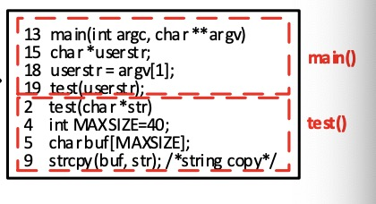

    2.2 label: 1——Code gadget有漏洞，0——无漏洞，文中使用了SARD数据集[https://samate.nist.gov/SARD/](https://samate.nist.gov/SARD/)

3. 将code gadget编码为固定长度的向量

    3.1 去掉非ASCII字符，将用户自定义的变量、用户自定义的函数转换为对应的特征符号VAR1，VAR2，FUN1，FUN2，等。

     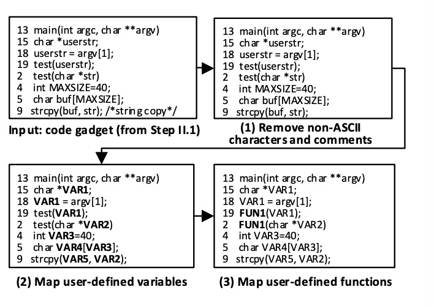

    （*这里将用户自定义的名字表示为通配符可能会导致不同的code gadget转变为相同的特征符号串，若相同的特征符号串对应不同的ground true，岂不有问题？个人认为code gadget一般都比较简短，不妨直接用户自定义的名字去编码，譬如用户自定义正好是程序的关键字/保留字之类的，也可发现是Bug.*）
    

    3.2 将特征符号编码为向量：
    如已将函数/API代码转换为特征符号表示：

    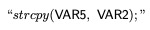

    分词为：

    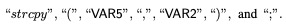

    然后根据词典表堆叠为一个向量表示。

    (*如果一个语句没明显的分隔符，如空格，怎么切分？这里作者也没详细交代怎么切分特征符号，可能还蕴含了一层预训练*)

4. 将向量输入到神经网络进行训练

    使用BiLSTM。

    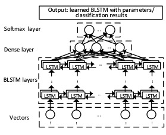

### 研究结论

数据集：将整个数据分为6个子集，各类型样本量如下：
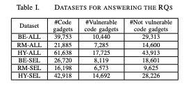

* BE: Buffer Error漏洞
* RM: Resource Manager漏洞
* HY: BE + RM
* ALL: 包含原数据集所有函数/API调用
* SEL: 经过人工筛选的的函数/API调用

1. 下图表示BE,RM，HY得出的数据有明显的差别：

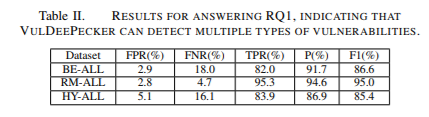
说明该系统可以检测多种类型的bug。但可能数据依赖性会比较强：RM的表现要优于BE，而实际中RM的数据量是远小于BE的数据量，怀疑是从数据量多的类型抽取漏洞的表现模式比从数据量少的更加困难。

2. 经过人工干预的样本集，训练出来模型的表现更优：

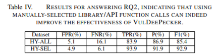

表明增加先验知识有助于提高模型的性能。

3. 和目前一些静态漏洞检测工具对比，该系统表现明显更优：

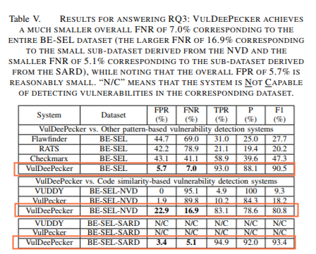\

4. 当前限制
    * 只能处理C/C++程序
    * 只能处理基于函数/API调用的Bug
    * 暂时只能基于数据流分析，而不能基于控制流
    * 只使用启发式方法标注code gadget，将code gadget转换为特征表示，和将可变长的code gadget编码为定长的向量
    * 只能使用BiLSTM
    * 使用的数据集只包含缓存错误和资源管理错误两类Bug

### 个人启发：

1. 比较详细的总结出将代码编码为向量的方法论；
2. 验证了深度学习在检测Bug方面的可行性和有效性；
3. 实验中只区分了有/无漏洞（二分类问题），没进一步对多分类方面给出验证；
4. 只发现代码段是有Bug，但不能定位到Bug发生的具体位置（代码行）

* *附：论文链接[https://arxiv.org/pdf/1801.01681.pdf](https://arxiv.org/pdf/1801.01681.pdf)*