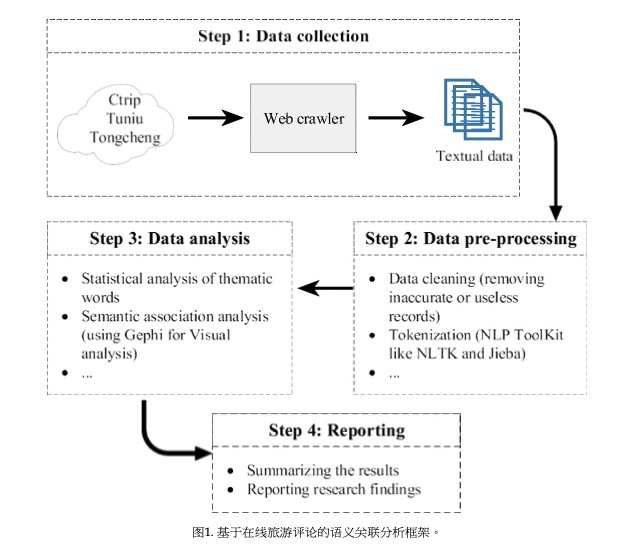

## 《Opinion mining from online travel reviews: A comparative analysis of Chinese major OTAs using semantic association analysis》阅读报告

### 研究现状

目标：基于社会网络理论的视觉对在线旅游评论进行语义关联分析，以探索游客的潜在需求，并发现这些需求之间的联系。

### 研究方法

分析流程架构

