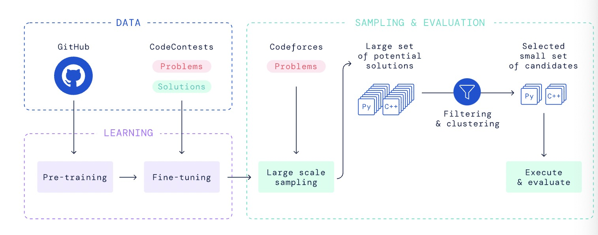
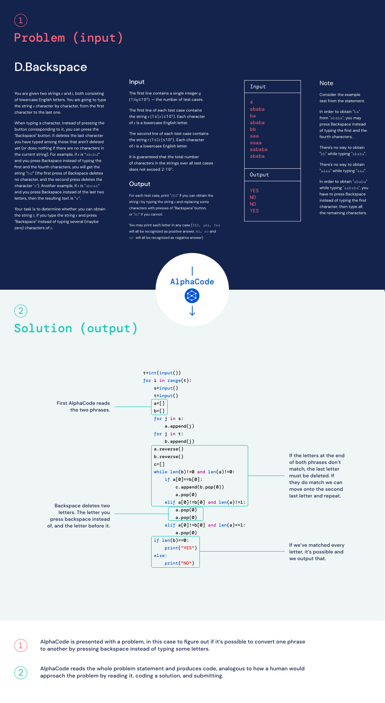
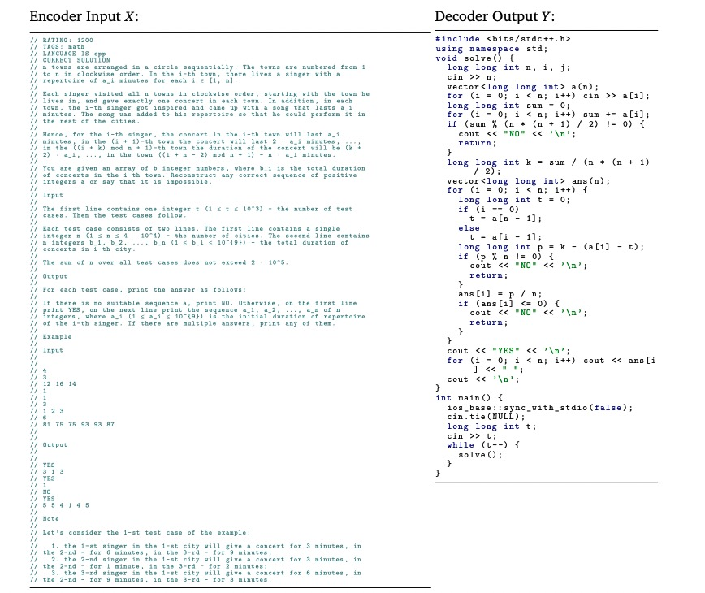
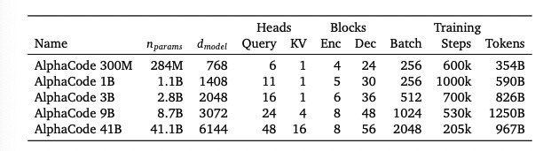
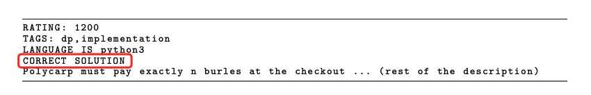

## 《Competition-Level Code Generation with AlphaCode》阅读报告

### 研究现状

现有的大型Language Model已经被证明可以用于生成代码，但是只能生成一些短小的代码片段，或者在解决复杂、不可见的、需要编程技巧的问题上，这些模型的性能还很弱。面临的挑战有：

1. 需要搜索大量的代码：
    ```
    Generating code that solves a specific task requires searching in a huge structured space of programs with a very sparse reward signal.
    ```
    1.1 仅仅改变单个字符就有可能改变整个程序的逻辑，即使这没有引起崩溃，所以代码的相关性不能仅仅依靠文本字面上的相关性；
    1.2 一题多解：同一个问题可能有多种编码逻辑可供选择
    1.3 在很多（编程）领域，尤其是编程竞赛，对于每个问题常常只有有限个样本和解题方案可供训练

2. 衡量代码是否有效的测试用例通常是不可见的，需要提供一个有效的测评代码的基准。

现有的方案在生成大型程序代码上还不可靠，加上有效测试用例的缺乏，使得存在较高的假阳性率（false positive rate）。

本文的任务：

1. 提出一个生成代码的新新方案：AlphaCode，使用大型transformer模型，用GitHub上的代码pre-train，然后在精选过的编程竞赛问题上fine-tuning，总体流程如下：


```
1.1 pre-train
1.2 fine tune
1.3 Large scale sampling: Generate a very large number of samples fomr our models for each problem.
1.4 Filter the samples to obtain a small set of candidate submissions (at most 10), to be evaluated on the hidden test cases, by using the example tests and clustering to pick samples based on program behaviour. 
```

2. 发布新的关于编程竞赛数据集CodeContests，用于模型训练：


3. 证明本文生成代码的方法并非直接复制训练集的代码片段，而是根据自然语言描述生成的。

本文的创新点在于：便捷、高效的sampling和filtering解题目代码上。

### 研究方法

#### 数据集构建:CodeContests

1. 数据结构包含：
1.1 题目难度等级
1.2 解题方法归类标签，如"greedy"、"dp"
1.3 编程者的正确、错误的提交，编程语言有C++、Python、Java
1.4 测试用例，含题目自带的样例测试用例（example test）和评分用的测试用例（hidden test cases）

数据样本如下：


2. 为了防止数据“泄漏”（将训练集用于模型测试），本文对整个数据作了如下划分：所有训练集都在GitHub提交的日期2021/07/14或其之前；验证集的提交在2021/07/15至2021/09/20期间；测试集的提交2021/09/21之后

#### 模型架构

1. 基于seq2seq架构，对条件概率建模$p(Y | X)$，其中X为编程问题的描述（encoder的输入），Y为自回归的输出一个个代码token(decoder的输出)。

    

    本文还发现：使用浅层的encoder(层数少)和深层的decoder（层数多）的搭配可以极大改善模型的性能。
各种模型配置如下：

    

2. 使用JAX、Haiku工具建立模型

3. 使用multi-query attention（hoho_todo）：每个attention block使用全量的query heads，而key和value heads只使用一部分（共享key和value heads），这样可以减少内存和cache的使用，提高sampling的效率。

4. tokenize：使用SentencePiece tokenizer（hoho_todo）方法，使用GitHub和自身CodeContest数据集一共8000个token，encoder和decoder都使用相同的tokenizer

#### Pre-training

使用GitHub的代码进行预训练。

encoder使用masked language modeling
decoder使用标准的交叉熵损失预测下一个token

将GitHub代码文件均匀切分为两部分，前半部分作为encoder的输入，后半部分用于decoder

#### Fine-tuning

使用自身CodeContests数据进行模型微调。

同样，encoder使用masked language modeling
decoder使用标准的交叉熵损失预测下一个token。

encoder输入为问题的自然语言描述，而解题的代码用于decoder。

另外，本文还使用了以下一些技巧：

1. Tempering:
```
Tempering, introduced by Dabre and Fujita (2020)([ Softmax tempering for training neural machine translation models.](https://arxiv.org/pdf/2009.09372.pdf)), is a regularization technique that makes the token probability distribution artificially smoother or sharper at training time by dividing
the output logits of a model by a scalar temperature  before the softmax layer
```
softmax tempering旨在解决NMT模型过拟合问题，因为 softmax分布很快接近黄金标签分布。

旧的计算交叉熵损失的方法：

$P_i = P(Y_i | Y_{<i}, X) = softmax(D_i) $
$loss_i = -\left< log(P_i, L_i) \right> \cdot T$，其中$\left<.,.\right>$为点积运算

softmax tempering计算方法：

$P^{temp}_i = softmax(D_i / T)$
$loss^{temp}_i = -\left< log(P^{temp}_i, L_i) \right> \cdot T$

其中$D_i$为decoder第i个位置的输出，$L_i$为对应标签的one-hot向量。

当T大于1.0时，softmax输出的概率会更加平滑（smoother probability distribution），分布越平滑越均匀，熵就越高，因此预测时就有更多的不确定性。

```
Because loss is to be minimized, back-propagation will force the model to generate logits to counter the smoothing effect of temperature. During decoding with a model trained in this way, the temperature coefficient is not used and the logits will be such that they yield a sharper
softmax distribution compared to those of a model trained without softmax tempering
```

(关于logits的理解：深度学习中经常出现logits，应该是表示进入softmax之前神经层的输出)

2. Value conditioning & prediction

数据集包含一道问题的正确和错误的提交，本文使用Value conditioning & prediction区分这两类的提交。

在Value conditioning阶段，在问题描述中插入这个提交是否正确的信息，如下：



然后在采样阶段，solution都填“正确”，模型就会采样到正确的sample了。

而在Value prediction阶段，会加入一个辅助的预测任务（训练中才有），以便在transformer中的最后一层输出也可以用来区分这个代码提交的正确与否：
```
we added an auxiliary value prediction task during training such that the last layer token representations before projecting to logits are also used in a small Transformer to classify whether the submission is correct.
```

3. GOLD

每个问题可以有多种解法，因为有不同的算法选择、实现方式等。那么每个问题描述就会对应多个解法。使用标准的最大似然估计去最小化损失函数是通过赋予每个解法不同的权重（类似于recall），而本文希望模型尽可能只生成一个正确解法（类似于precision），于是求loss导数采用了一种offine RL算法（GOLD: [Text Generation by Learning from Demonstrations](https://arxiv.org/abs/2009.07839)），其求导如下：

$$ \triangledown \pounds_{GOLD}(\theta ) = -\sum_{s \epsilon\quad Solution\quad tokens}^{} P_\theta (s) \triangledown log P_\theta (s) $$
其中$\theta$是模型参数，$logP_\theta(s)$是标准的最大似然估计，$P_\theta(s)$赋予一个权重，让模型学习似然值高的tokens，而忽略其他tokens，这样模型就会更加关注与精确率而不是召回率，增加只找到一个精确解的概率。
同时，为了降低训练的稳定性，对$P_\theta(s)$作如下限制：
$(P_\theta(s)^\alpha, \beta), \alpha=\frac{1}{2}, \beta=0.05$

### 研究结论


### 启示

1. multi-query attention对transformer计算性能的影响


### 附：

* 数据集：

[https://github.com/deepmind/code_contests](https://github.com/deepmind/code_contests)

[https://codeforces.com/](https://codeforces.com/)

* 应用：

[https://alphacode.deepmind.com/](https://alphacode.deepmind.com/)