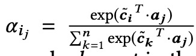

## 《code2vec: Learning Distributed Representations of Code》阅读报告

### 研究现状
word2vec，doc2vec的出现

### 研究目标

主要: 学习code embedding

具体来说，将函数编码，预测其函数名（跟代码变摘要有点像），有次学习得"副产品"code embedding

### 研究方法

#### 数据的生成
1. 生成AST

2. 函数体内的语句根据句法分析，生成一个个叶节点与叶节点之间的路径

如有：

形成一个path-contexts集：

* ↑表示结点沿AST路径向上， ↓则沿路径向下

* 为了限制训练数据的规模（不要过大）和减少数据的稀疏性，引入两个超参：path的最大长度和具有相同父结点的两个孩子结点序号的最大差值（path两端点的“宽度”）

* path-context其实由三个表示为一个三元组（x_s, p_j, x_t）

#### 模型架构

1.将（x_s, p_j, x_t）三个向量（每个context vector, 大小1xd）拼接为一个一个（1x3d）的向量，输入全连接层，将其信息“压缩”为1xd向量(combined context vector)。

“This combination allows the model the expressivity of giving a certain path more attention when observed with certain values and less attention when the exact same path is observed with other value。”

2. 将多个path-context的组合向量聚合为一个1xd向量（code vector），以表示这段代码。

利用Attention机制：声明全局的注意力向量a，将每个path-context组合后的向量与a点积，赋予每个path-context对于这段代码特定的关注度（权重），该全局注意力向量也一起参与学习。

3. tag名（标注，函数名）也作embedding（y vector）,code vector与每个y vector做softmax，计算概率大小：

4. 损失函数：交叉熵

### 结论

1. 

2. 

* Hard attention: 在与注意力向量点积后，只选取权值最高的combined context vector作为最终的code vector

* Element-wise soft attention: 使用d个全局注意力向量（d个数跟combined context vector维度相同）（感觉这里有点像transformer多头注意力的操作）

3. 注意力的可解析性（path-context的粗细）

4. code embedding的可解析性

* 语义的相似性

* 语义的可组合性

* 语义的可类比性

### 研究不足

1. 只能预测出在训练时已有的label

2. 数据稀疏性（数据饥饿），到时训练代码高
* 终止节点（叶节点的value）语义相近，却表示为不同的向量
* 只有单个不同的节点的path，却表示为不同向量
* target节点也有类似问题（语义相近，却向量不同）

3. 对变量名的依赖：用语义明确的变量名训练，预测准确性较高。用不太明确语义的变量名，预测的效果较差。（数据的偏见）

### 启发

1. 多个维度的“压缩”信息
2. 利用注意力生成代码向量
3. 注意力的可解析性（path-context的粗细）

### 附：

* 文献链接：[https://dl.acm.org/doi/pdf/10.1145/3290353](https://dl.acm.org/doi/pdf/10.1145/3290353)

* 代码：[https://github.com/tech-srl/code2vec](https://github.com/tech-srl/code2vec)

* 相关工具：[https://code2vec.org/](https://code2vec.org/)