## 《基于信息检索的软件多特征缺陷定位方法研究》阅读报告

### 研究现状

目前缺陷定位方法大致有两个主流方向：
* 基于程序频谱（Sepctrum Based Fault Localization, SBFL），着重于程序执行，依赖分析程序的动态执行信息和成功/失败的测试用例执行轨迹，对它们进行统计计算，从而进行缺陷定位。

* 基于信息检索（Information Retrieval Based Bug Localization, IRBL），通过从给定的缺陷报告和项目的源代码来提取重要特征，计算特征之间的潜在相似度并对源代码进行排名，从而获得于缺陷报告描述的缺陷疑似匹配的前几个源代码文件。

但动态缺陷定位方法（主要指SBFL）在大型软件维护过程中，开发人员总不能获得足够的测试用例和测试结果，仅能获得用户或测试人员提供的缺陷报告

而静态缺陷定位（IRBL）存在三点不足：

1. 对缺陷报告查询项的查询重构研究不足（噪声比较多）；
2. 特征考虑不充分；
3. 只着眼于文档间的表面文本相似性，这往往缺乏了对文本与代码的潜在语义进行特征表示。

本文分三章分别对应以上三点不足，阐述相应解决方案。

### 研究方法

* IRBL的总体流程

1. 将缺陷报告作分词处理，把预处理之后的缺陷报告看作是查询项Query；
2. 将软件开发项目中的所有源代码文件建立一个语料库Documents，将其看作是被查询的所有文档项；
3. 当用户或测试人员提交缺陷报告时，进行一次检索工作：提取并计算缺陷报告和源代码的相关特征，通过自然语言领域算法处理，得到报告和源代码直接的相关度，按照相关度排名，越靠前排名的源代码，越有可能包含缺陷；

#### 对缺陷报告重构研究不足的改进

当前，用户提交的缺陷报告内容与开发者希望收到的信息之间不匹配，软件开发者需要的信息是缺陷报告中的堆栈信息和测试用例信息等测试过程中收集的信息，而用户很难提供这些信息

* 对缺陷报告的分类：
1. 富查询： 包含程序元素（类名、方法名、变量名）
2. 噪声查询： 包含堆栈跟踪信息
3. 不良查询： 只有自然语言描述

本文主要针对该类缺陷报告，采用自动查询重构的方式提高查询质量。

主要有三种方法：
1. 如果报告带有文本附件，提取其中的文本信息，对缺陷报告desciption字段进行扩展，使不良查询转变为富查询、噪声查询

2. 基于启发式规则的动宾短语过滤：从“summary”和“description”部分提取动宾短语（VP字段），因为这是最能表征缺陷报告的文本片段：

    2.1 进行句法分析，提取动宾短语。本文使用Stanford CoreNLP库（字符串格式）和python的NLTK的Tree类，提取的句法分析树如下：

    

    2.2 对动宾短语进行过滤：指定过滤规则，然后设置阈值，针对每一个VP，若该字段满足设定的规则，则在分数上加上规则设置的分数，若不满足，则在已有分数上减去规则设置的分数。本文使用的过滤规则如下：
        a. 基于动词-名词规则：对不包含动词或名词的VP，直接设置评分为0，直接删减掉；
        b. 基于扩展停用词表的规则：

        （1）常规的停用词表含有：“a”、“the”、“an”等词，作者将情感语气词如“can”、“could”、“may”、“must”也加入停用词表，因为撰写人员的心情与源代码实现的功能无关。
        （2）在VP的动词位置上是停用词表的情感动词，直接将该VP分数置为0，直接删掉；若非动词位置上出现情感动词，该VP评分减1分
        （3）在VP的名词位置上是代词且该单词起主要作用，则将该VP评分将为0，直接删掉；若名词位置包含代码但该单词没起主要作用（hoho:如何判定是否起主要作用？），则减2分；若VP非名词位置包含代词，则减1分

        例子：对于语句：“In order to test exception scenarios in an existing framework, I havecreated an aspect to inject an execption”，提取到如下两个VP：“test exception scenarios”和“created an aspect to inject an exception”

3. 候选词提取：使用伪相关反馈提取。
什么是相关性反馈Relevance Feedback：在搜索过程中，在简单制定一个查询后，如果尝试发现初始查询结果不尽人意，则可以通过与搜索引擎进行明确的查询一相应会话，或更自动的通过分析为初始查询检索到的文档以寻找方法来完善原始查询，扩充它以供进一步检索。
    如显式相关反馈，过程如下：
    （1）用户提交查询；
    （2）检索系统针对查询需求进行计算，并返回第一次检索结果给用户；
    （3）当看到搜索引擎返回的第一组检索结果后，用户通过标记相关和不相关的结果集来明确提供自己的判断；
    （4）系统通过用户反馈重新计算查询并向用户提供一组新的检索结果。；
    （5）重复 2-4 过程，直到找到所有目标文件。
    但这种查询会延长会话时间，且需要人工参与，不适用。

本文使用的伪相关反馈为：不需要用户重复建立查询，在获得第一组检索结果后，将前X个检索到的文档集D视为相关文档集的近似值，并选择这些文档中的“最佳”词项来重新编制查询。在寻找“最佳”词项过程中，需要通过计算对文档词项权重来对词项进行排序，本文使用tf-idf加权方法计算。如果D中的文件获得最高的检索分数，因此它们很可能包含在概念上与原始查询相关的其他信息术语。

#### 对特征考虑不充分的改进

对被测试软件缺陷报告和源代码的结构化特征进行挖掘，捕获它们之间的潜在对应关系。

使用summary和desciption作为缺陷报告数据集，针对每一个缺陷报告与源代码文件对<d, s>，提取六个特征来如下：

1. 缺陷报告与源代码文件之间的文本相似性

使用向量空间模型VSM的改进rVSM。
VSM的主要思路：是将每个文档都表示为基于tf和idf权重的向量，向量中的每个元素都对应一个词项，然后通过计算各个文档之间的余弦相似度得到一种文本相似度。
但由于 VSM 算法对于小型文档的相似度而言，容易计算得到较大相似度，而长文档的相似度值通常很低，较大的源代码文件包含缺陷的可能性更高，因此，定义 Logistic 一个函数来对 rVSM 中的文档长度进行建模，确保较大的文档在排名期间被基于较高的分数：

$$g(\#terms) = \frac{1}{1 + e^{-N(\#terms)}}$$

其中#terms表示文档中单词的数量。

N(x)为标准化函数：

$$N(x) = \frac{x - x_{min}}{x_{max} - x_{min}}$$

则rVSM相似度计算公式为：

$$rVSMScore(r, s) = g(\#term) * cos(r, s) = g(\#term) * \frac{\overrightarrow{V_r}\bullet \overrightarrow{V_s}}{|\overrightarrow{V_r}| |\overrightarrow{V_s}|}$$

其中，向量Vs和Vr中的权重w为tf-idf值：

$$w_{l\in r} = tf_{lr} * idf_l = (logf_{lr} + 1) * log(\frac{\#docs}{n_t})$$

(
回顾：
$$ 词频TF = \frac{某个词在文章中出现的次数}{文章的总次数} $$

$$逆文档频率IDF = log \frac{语料库的文档总数} {包含该词的文档数 + 1}$$
)

2. 源代码文件历史修复缺陷时间变更得分

利用以下两点先验知识：
1）在K天内被多次修改的源代码文件很可能会继续包含缺陷; 
2）在之前已经被修复的源代码文件，很有可能再次包含缺陷;

假设br(r, s)为创建缺陷报告r之前已修复源代码文件s的一组集合，last(r, s) 属于br(r, s),为最新的先前修复的缺陷，则时间变更度量得分为：

$$
Score_{time} = \frac{1}{r.month - last(r, s).month + 1}
$$

r.month为缺陷报告r提出的月份

3. 源代码文件的修复次数特征

缺陷报告r提交时，通过对源代码文件s的修复次数进行统计：

$$F_i = |br(r, s)|$$

并将Fi进行缩放如下：

$$
Score_{count} = \left\{\begin{matrix}
0 & , F_i < F_{min} \\
\frac {F_i - F_{min}}{F_{max} - F_{min}} & , F_{min} < F_i < F_{max}  \\
1 & , F_i > F_{max} \\
\end{matrix}\right.
$$

4. 缺陷报告中的堆栈跟踪信息

$$
Score_{tracer} = \left\{\begin{matrix}
\frac {1}{rank} & , s\in r_{tracer} \quad and \quad rank <= 10 \\
0.1 & , s\in r_{tracer} \quad and \quad rank <= 10 \quad or \quad s\in r_{tracer.import}  \\
0 & , otherwise \\
\end{matrix}\right.
$$

其中$r_{tracer}$是出现在缺陷报告中的所有源代码集合，$r_{tracer.import}$是$r_{tracer}$调用的所有源代码模块。

5. 缺陷报告与源代码文件之间的类名相似度特征

计算缺陷报告文本信息与源代码文件中的类名之间的文本相似性，依然用rVSM计算。

（对源代码类名及方法名提前，使用Python的javalang工具）

6. 缺陷报告与所有历史缺陷报告的协同过滤得分

协同过滤的主要假设是：如果某些人在一些事物中具有相同的兴趣爱好，那么他们在其他事务中也可能具有相似的兴趣。对于软件缺陷定位领域来说，可以认为在新的缺陷报告 提交时，若在缺陷跟踪系统中能找到与新的缺陷报告相似的历史缺陷报告，则它们对应的缺陷源代码也很可能是同一个文件。

本论文中将结合协同过滤特征参数，给定一个新的缺陷报告r与历史缺陷报告集B，缺陷报告r的协同过滤分数$Socre_{collaborative}$为缺陷报告r与所有历史缺陷报告的文本相似度求平均值：

$$
Score_{collaborative}(r, s) = \sum_{n}^{k=1}\frac{1}{k}\quad rVSMScore(r, B_k)
$$

得到以上6个特征后，使用多层感知机（MLP）进行特征融合:

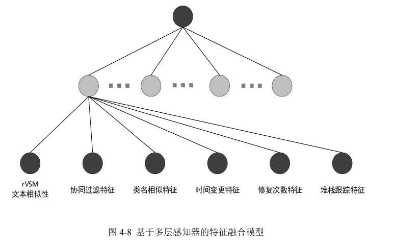

* 类不平衡问题：大多数训练数据中缺陷报告仅与少数几个源代码文件相关，而与大部分源代码是不匹配的。本文使用负采样方法生成训练数据
另：一般解决类不平衡问题，在数据级别，可采用过采样：通过SMOTE、ADASYN等方法增加样本量少的样本；或欠采样：减少丰富类的大小。在算法级别，目前最流行是代价敏感学习，通过给少数类误分类给予较高的惩罚，并给多数类分配较少的惩罚，手动提高少数类的重要性。

#### 缺乏了对文本与代码的潜在语义进行特征表示的改进

步骤
1. 对缺陷报告，进行word2vec，输入多尺度卷积神经网络（MCNN）提取潜在特征。

本文使用的是预训练Word2vec模型，基于Wiki语料库。
对summary和description合并，使用上一节“对特征考虑不充分的改进”对其分词、去停用词、去符号和纯数字，最后使用word2vec编码为向量$V_r$。

2. 对源代码，将每行代码进行词项权重加权的word2vec，再送入MCNN提取特征。

第l行代码向量生成方法为：

$$V_i = \frac{1}{n_l} \sum_{i=1}^{n_l} w_i v_i$$

其中wi为第l行代码中第i个单词的tf-idf权重，vi是第l行代码中第i个单词的单词向量，最终生成行向量$V_{sm}$

3. 将源代码转换为AST，将AST转换为代码向量，送入MCNN特权特征。

由于抽象语法树含有较多冗余属性，需要筛选出若干结点作为算法结点，选用结点如下：

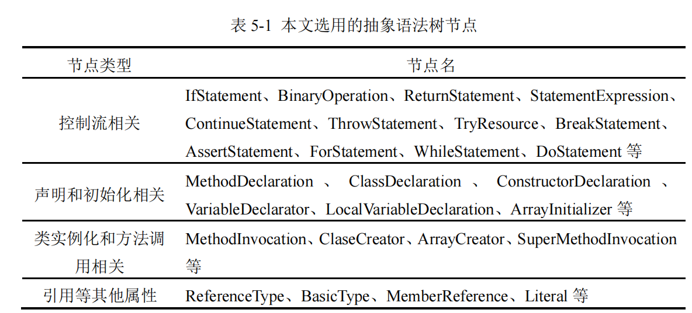

若抽象语法树层数还较高，序语继续对部分结点进行删减：
（1）若非叶节点的孩子节点中包含节点名属性（就是绿色框那些的方法名和变量名），则将该结点替换为节点名；
（2）删除该结点的孩子节点除节点名外的所有属性；

例如，有如下AST:

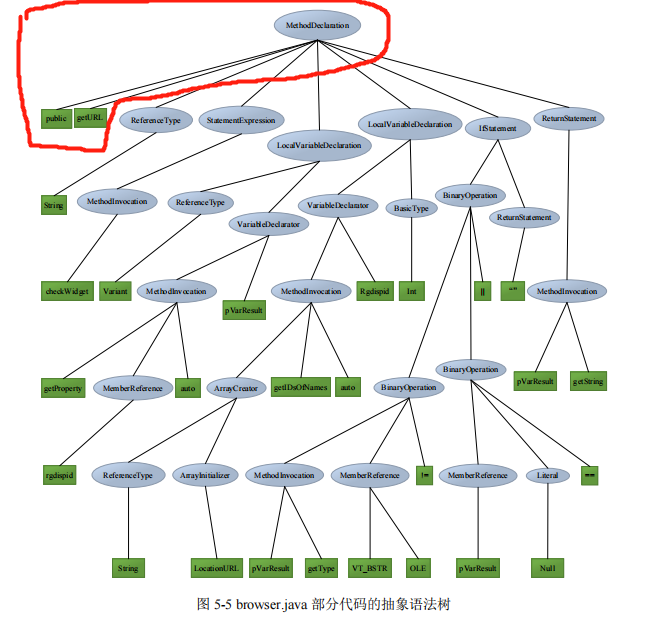

根结点MethodDeclaration，包括public属性和节点名属性getURL，则将methodDeclaration替换为getURL，并将public结点删除，结果如下：

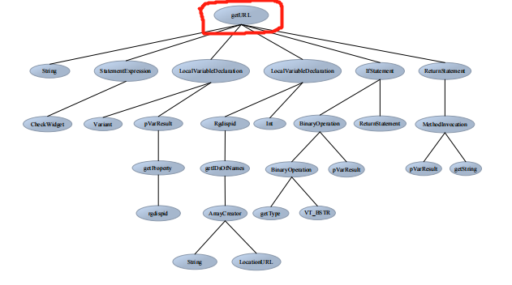

然后，将节点与其父节点组合作为训练数据。
对于不含复合词的节点，直接使用该词与父节点组成的词对向量。
对含有复合词的结点，如：复合词LocalVariableDeclaration结点和其父节点getURL结点，分别拆分为Local、Variable、Declaration和get、URL，组合词对为“get-Local”、“get-Variable”、“get-Declaration”、“URL-Local”、“URL-Variable”、“URL-Decaration”，该节点的词嵌入向量机位上述六个词对的嵌入向量求和并取平均，得到该节点的向量。

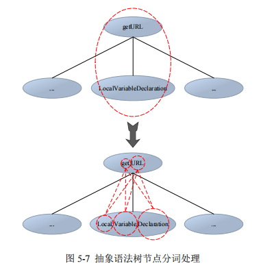

那么对整个AST，使用深度优先遍历，得到所有节点的特征向量，然后通过MCNN进行特征提取得到向量$V_{ssf}$

4. 以上3中特征拼接后，最后使用一个CNN训练缺陷报告与对应源代码文件之间的相似关系。

将上述三个向量$V_r$、$V_{sm}$、$V_{ssf}$进行上下堆叠，最后使用CNN进行训练，卷积核大小为3x3，并进行padding填充操作，是卷积核对边缘信息的提取更加充分。

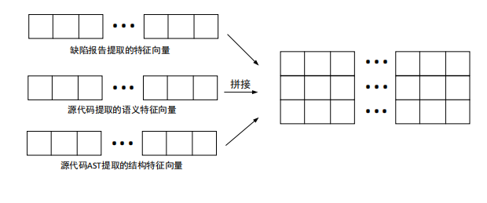

本文使用何凯明等人提出的Focal loss交叉熵损失函数：
$$
Loss_{fl} = \left\{\begin{matrix}
-\alpha (1 - \widetilde{y})^{\gamma} log\widetilde{y} & ,y = 1 \\
-(1-\alpha) \widetilde{y}^{\gamma} log(1-\widetilde{y}) &, y = 0  \\
\end{matrix}\right.
$$

并结合batch normalization，使用Adam优化方法进行训练。

总体架构：

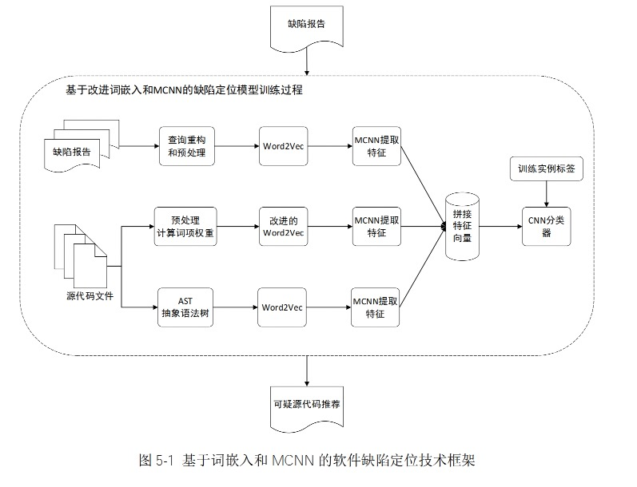

即使用TextCNN：

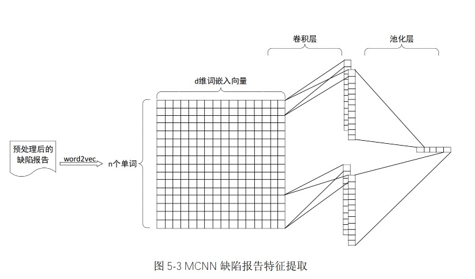

本文使用三种宽度大小的卷积核（k = 1, 2, 3）

### 研究结论

#### 对缺陷报告重构研究不足的改进

* 数据预处理：
1. 收集到缺陷报告，筛选出状态为Fixed（已修复）的进行实验评估
2. 获取缺陷报告与相应修复文件之间的对应关系：
（1）用正则表达式匹配的方式从 Git 版本迭代日志中筛选出缺陷 ID（例如“bug 320437”），然后过滤掉假正例数字
（2）检查 Bugzilla 系统缺陷报告数据集中是否存在 Git 日志中筛选出的缺陷ID，提取出缺陷报告并将缺陷报告与缺陷 ID 对应
3. 仅提前缺陷报告中的summary和description字段文本内容，不对文本内容进行分词、去停用词和词干化等预处理

* 评价指标（指标值越高，性能越好）
1. MAP(Mean Average Precision)，评估开发人员查找所有错误文件所付出的努力，例如 MAP@10 衡量了前十名结果中所有排名缺陷的文件的质量：

$$MAP@Q = \frac{\sum_{Q}^{i=1}AP_i}{N}$$
$$AP_i = \sum_{M}^{j=1}\frac{j}{pos(j)}$$

其中j是排名可疑源代码文件的排位，M是可以源代码文件的数量，pos(j)是前Q的结果中若第j个文件是缺陷源代码文件，则置位0，否则置位1（hoho: pos(j)为0咋办？是分母喔。。。），i是缺陷报告索引，N是缺陷报告总数量。

2. Accuracy@K，排序列表大小在K内发现有缺陷的源代码的缺陷报告所占的百分比。K设置为 1、5 或 10。此度量标准评估开发人员是否可以在K个源代码内找到第一个缺陷源代码文件：

$$Accuracy@K = \frac{\sum_{N}^{i=1} topK(i)}{N}$$

其中i是缺陷报告索引，N是缺陷报告总数量，topK(i)是第i个缺陷报告对应的排名最高的缺陷源代码是否位于前K位，是则置位1，否则置位0

3. MRR(Mean Reciprocal Rank)，指标评估开发人员发现第一个 bug 文件的速度，例如 MRR@10 是前 10 个结果中第一个缺陷源代码文件的位置的倒数：

$$MRR@Q = \frac{\sum_{N}^{i=1}\frac{1}{rank(i)}}{N}$$

其中i是缺陷报告的索引，N是缺陷报告的数量，rank(i)是排名前Q位的列表中第i个缺陷报告中排名最高的包含缺陷的源代码文件的排位。

* 结果
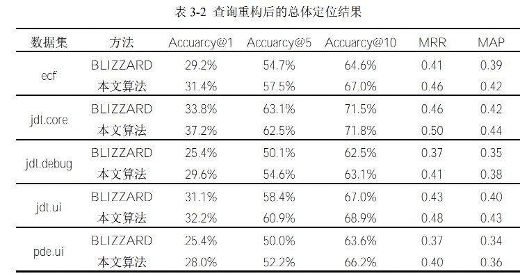

#### 对特征考虑不充分的改进

* 对缺陷报告的预处理
1. 提取summary，去除“bug id”字段，并清洗
2. 提取description
3. summary和description合并
4. 用python的NLTK库去掉标点符号和标准停用词
5. 拆分复合词（如RenderedToolbarRenderer拆分为Rendered、Toolbar、Render）
6. 词干化处理（add、adds、adding均转化为add）
7. 大写字母转化为小写字母

* 对源代码的预处理
1. 用python的javalang提取类名和方法名
2. 对源代码文件每一行采用与缺陷报告一致的处理方式
3. 提取改进中提到的6个特征
4. 采用十折交叉法划分训练集和测试集

* 实验结果

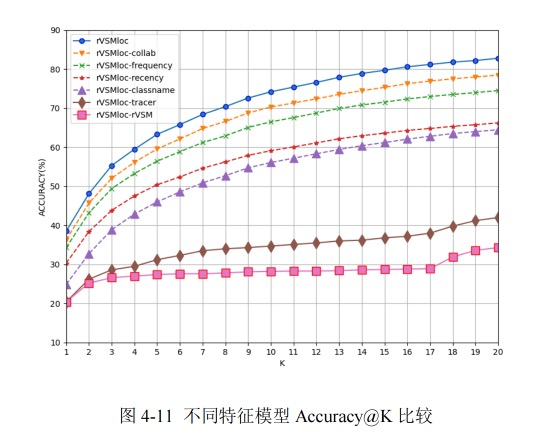

融合6个特征的rVSMloc效果最好。

所有特征均能提高缺陷定位方法性能，可以看出在对性能提升方面，文本相似特征>堆栈跟踪信息>类名相似性>时间变更性>修复次数特征>协同过滤特征，基于文本信息计算的相似特征起着决定作用，其他特征起着优化作用。

与其他模型的对比：

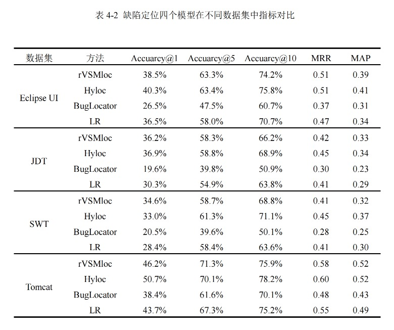

#### 缺乏了对文本与代码的潜在语义进行特征表示的改进

缺陷定位方法总体框架：

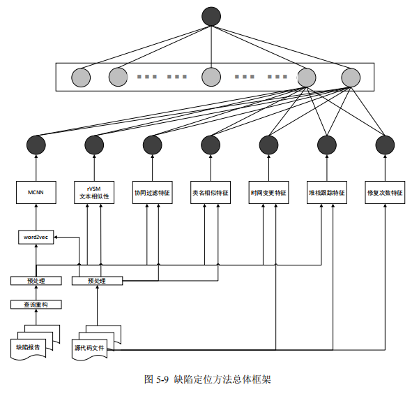

* 使用本文自身三种模型效果对比：
（1）WE-MCNN，本文使用的模型
（2）rVSMloc，不考虑语义特征和源代码结构特征的缺陷定位模型（即第二节改进的方法）
（3）NCS-MCNN，在rVSMloc基础上，不考虑基于ASTd的结构特征，仅考虑语义特征的模型

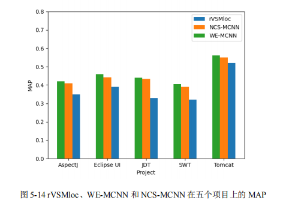

* 和其他模型对比：

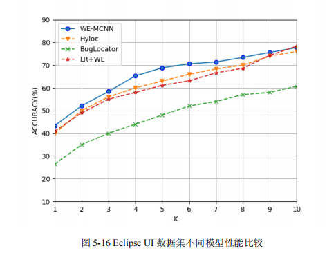

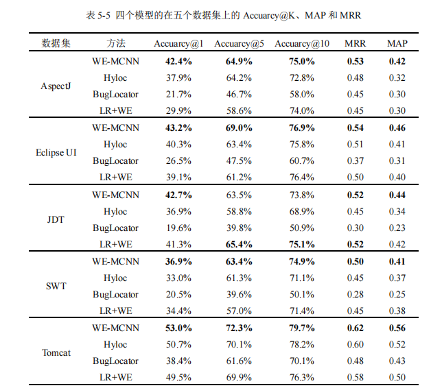

总体上，实验结果证明了本文模型的可行性，词嵌入和 MCNN 用于软件缺陷定位提高定位准确性是可预知的，但是本文模型的有效性仍存在一些潜在的风险因素。

首先本文提出的方法的性能在某种程度上取决于词嵌入技术的能力，更优秀的方式是在应用到模型之前测试这些词嵌入技术，而改进词嵌入技术也将有助于增强本文模型。其次，关于卷积核尺度选择的分析与开发人员的写作风格有关，例如，如果项目团队中的开发人员更喜欢使用很长的短语来表达错误报告，则过滤器的大小也应该很长，目前本文仅针对部分数据集的结果并提供一般性结论。

### 附

* 数据集： 
1. BLIZZARD相同的数据集【参考文献23】
2. 参考文献26
3. “对特征考虑不充分的改进”一节用到的数据集：[https://figshare.com/articles/dataset/The_dataset_of_six_open_source_Java_projects/951967](https://figshare.com/articles/dataset/The_dataset_of_six_open_source_Java_projects/951967)