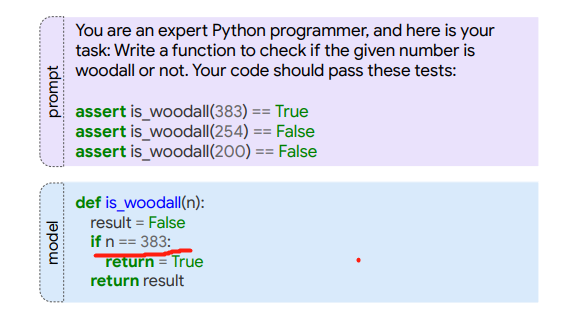

## 《Program Synthesis with Large Language Models》阅读报告

### 研究现状

### 研究方法

模型方面主要使用只有decoder的transformer模型（已在web文档、对话数据和wikipedia数据进行预训练）。

在测试生成能力时使用了两种机制：

1. few-shot prompting 
2. fine-tune

在验证模型准确率时，对于测试集（MBPP和MathQA-Python）的每个问题，使用temperature sampling(temperature值为0.5)生成80个代码样本进行验证。

另外为了验证模型能否产生跟运行代码相同的结果，单独对MBPP测试集使用greedy decoding（temperature值为0.0）生成一个近似的结果，跟代码运行的结果作对比。

### 研究结论

1. 模型越大，性能越好
2. 在prompt时，生成性能不会对测试用例的数量敏感
3. 性能对prompt本身的内容很敏感
4. 生成的结果一般可以泛化到held-out test case
5. 时而会过拟合，如下图，只是简单的做出判断逻辑

6. 采样策略很重要：当只有一个测试用例验证时，设置低的temperature值（更多greedy decoding）；但更高的temperature值（更少的greedy decoding）可以在大概10个样本中解决问题（通过测试用例）
7. 生成性能跟BLEU分值不太相关
8. 本实验在训练时“偷看”测试集的问题很少。如何量化这种现象？本文对MBPP数据集统计了有多少行代码同时在训练集合ground true中出现（Pre-train/Test Overlap）。统计结果发现：训练集只有3.3%的样本中有超过一半的代码行跟pre-train集合重复，有91.5%的测试样本只有1或2行代码跟训练集重复。
9. 经过人工编辑过的样本可是模型性能提升

### 附

* 论文地址：[https://arxiv.org/abs/2108.07732](https://arxiv.org/abs/2108.07732)
* 数据集：[https://github.com/google-research/google-research/tree/master/mbpp](https://github.com/google-research/google-research/tree/master/mbpp)

* MathQA转换为MathQA_Python脚本: [https://github.com/google/trax/blob/master/trax/examples/MathQA_Python_generation_notebook.ipynb](https://github.com/google/trax/blob/master/trax/examples/MathQA_Python_generation_notebook.ipynb)

### 遗留问题

1. few-shot prompting
2. fine-tune 方法
3. temperature sampling（与greedy decoding）
