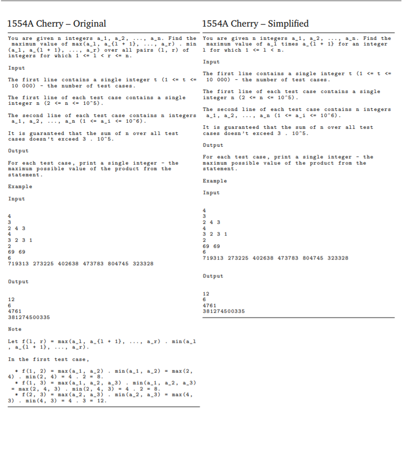

## 《Competition-Level Code Generation with AlphaCode》阅读报告

### 研究现状

现有的大型Language Model已经被证明可以用于生成代码，但是只能生成一些短小的代码片段，或者在解决复杂、不可见的、需要编程技巧的问题上，这些模型的性能还很弱。面临的挑战有：

1. 需要搜索大量的代码：
    ```
    Generating code that solves a specific task requires searching in a huge structured space of programs with a very sparse reward signal.
    ```
    1.1 仅仅改变单个字符就有可能改变整个程序的逻辑，即使这没有引起崩溃，所以代码的相关性不能仅仅依靠文本字面上的相关性；
    1.2 一题多解：同一个问题可能有多种编码逻辑可供选择
    1.3 在很多（编程）领域，尤其是编程竞赛，对于每个问题常常只有有限个样本和解题方案可供训练

2. 衡量代码是否有效的测试用例通常是不可见的，需要提供一个有效的测评代码的基准。

现有的方案在生成大型程序代码上还不可靠，加上有效测试用例的缺乏，使得存在较高的假阳性率（false positive rate）。

本文的任务：

1. 提出一个生成代码的新新方案：AlphaCode，使用大型transformer模型，用GitHub上的代码pre-train，然后在精选过的编程竞赛问题上fine-tuning，总体流程如下：


```
1.1 pre-train
1.2 fine tune
1.3 Large scale sampling: Generate a very large number of samples fomr our models for each problem.
1.4 Filter the samples to obtain a small set of candidate submissions (at most 10), to be evaluated on the hidden test cases, by using the example tests and clustering to pick samples based on program behaviour. 
```

2. 发布新的关于编程竞赛数据集CodeContests，用于模型训练：


3. 证明本文生成代码的方法并非直接复制训练集的代码片段，而是根据自然语言描述生成的。

本文的创新点在于：便捷、高效的sampling和filtering解题目代码上。

### 研究方法

#### 数据集构建: CodeContests

1. 数据结构包含：
1.1 题目难度等级
1.2 解题方法归类标签，如"greedy"、"dp"
1.3 编程者的正确、错误的提交，编程语言有C++、Python、Java
1.4 测试用例，含题目自带的样例测试用例（example test）和评分用的测试用例（hidden test cases）

数据样本如下：


2. 为了防止数据“泄漏”（将训练集用于模型测试），本文对整个数据作了如下划分：所有训练集都在GitHub提交的日期2021/07/14或其之前；验证集的提交在2021/07/15至2021/09/20期间；测试集的提交2021/09/21之后

#### 模型概述

1. 总体基于transformer的seq2seq架构，对条件概率建模$p(Y | X)$，其中X为编程问题的描述（encoder的输入），Y为自回归的输出一个个代码token(decoder的输出)。

    

    本文还发现：使用浅层的encoder(层数少)和深层的decoder（层数多）的搭配可以极大改善模型的性能。
各种模型配置如下：

    

2. 使用JAX、Haiku工具建立模型

3. 使用multi-query attention：每个attention block使用全量的query heads，而key和value heads只使用一部分（共享key和value heads），这样可以减少内存和cache的使用，提高sampling的效率。

4. tokenize：使用SentencePiece tokenizer方法，使用GitHub和自身CodeContest数据集一共8000个token，encoder和decoder都使用相同的tokenizer

#### Pre-training（训练阶段）

使用GitHub的代码进行预训练。

encoder使用masked language modeling
decoder使用标准的交叉熵损失预测下一个token

从GitHub抓取代码文件，文件中标记一个所谓的pivot point，将代码文件匀切分为两部分，前半部分作为encoder的输入，decoder用于重建后半部分，以自回归方式，一个个代码token预测，直到结束标记。

本文还使用masked launguage modeling技术作为第二个loss，目标是恢复被mask掉的那个token。

架构如下：


(by [https://www.youtube.com/watch?v=YjsoN5aJChA](https://www.youtube.com/watch?v=YjsoN5aJChA))

#### Fine-tuning（训练阶段）

使用自身CodeContests数据进行模型微调。

同样，encoder使用masked language modeling
decoder使用标准的交叉熵损失预测下一个token。

encoder输入为问题的自然语言描述，而解题的代码用于decoder。

另外，本文还使用了以下一些技巧：

1. Tempering:
```
Tempering, introduced by Dabre and Fujita (2020)([ Softmax tempering for training neural machine translation models.](https://arxiv.org/pdf/2009.09372.pdf)), is a regularization technique that makes the token probability distribution artificially smoother or sharper at training time by dividing
the output logits of a model by a scalar temperature  before the softmax layer
```
softmax tempering旨在解决NMT模型过拟合问题，因为 softmax分布很快接近黄金标签分布。

旧的计算交叉熵损失的方法：

$P_i = P(Y_i | Y_{<i}, X) = softmax(D_i) $
$loss_i = -\left< log(P_i, L_i) \right> \cdot T$，其中$\left<.,.\right>$为点积运算

softmax tempering计算方法：

$P^{temp}_i = softmax(D_i / T)$
$loss^{temp}_i = -\left< log(P^{temp}_i, L_i) \right> \cdot T$

其中$D_i$为decoder第i个位置的输出，$L_i$为对应标签的one-hot向量。

当T大于1.0时，softmax输出的概率会更加平滑（smoother probability distribution），分布越平滑越均匀，熵就越高，因此预测时就有更多的不确定性。

```
Because loss is to be minimized, back-propagation will force the model to generate logits to counter the smoothing effect of temperature. During decoding with a model trained in this way, the temperature coefficient is not used and the logits will be such that they yield a sharper
softmax distribution compared to those of a model trained without softmax tempering
```

(关于logits的理解：深度学习中经常出现logits，应该是表示进入softmax之前神经层的输出)

2. Value conditioning & prediction

数据集包含一道问题的正确和错误的提交，本文使用Value conditioning & prediction区分这两类的提交。

在Value conditioning阶段，在问题描述中插入这个提交是否正确的信息，如下：


然后在采样阶段，solution都填“正确”，模型就会采样到正确的sample了。

而在Value prediction阶段，会加入一个辅助的预测任务（训练中才有），以便在transformer中的最后一层输出也可以用来区分这个代码提交的正确与否：
```
we added an auxiliary value prediction task during training such that the last layer token representations before projecting to logits are also used in a small Transformer to classify whether the submission is correct.
```

3. GOLD

每个问题可以有多种解法，因为有不同的算法选择、实现方式等。那么每个问题描述就会对应多个解法。使用标准的最大似然估计去最小化损失函数是通过赋予每个解法不同的权重（类似于recall），而本文希望模型尽可能只生成一个正确解法（类似于precision），于是求loss导数采用了一种offine RL算法（GOLD: [Text Generation by Learning from Demonstrations](https://arxiv.org/abs/2009.07839)），其求导如下：

$$ \triangledown \pounds_{GOLD}(\theta ) = -\sum_{s \epsilon\quad Solution\quad tokens}^{} P_\theta (s) \triangledown log P_\theta (s) $$
其中$\theta$是模型参数，$logP_\theta(s)$是标准的最大似然估计，$P_\theta(s)$赋予一个权重，让模型学习似然值高的tokens，而忽略其他tokens，这样模型就会更加关注与精确率而不是召回率，增加只找到一个精确解的概率。
同时，为了降低训练的稳定性，对$P_\theta(s)$作如下限制：
$(P_\theta(s)^\alpha, \beta), \alpha=\frac{1}{2}, \beta=0.05$


#### 大规模采样（测试阶段）

训练一个transformer（其实就是pre-train和fine-tune那个transformer）负责解题solution的采样。将问题描述与问题的各种元数据（如问题tag、rating等）作为输入，代码sample作为输出。每个问题生成100万个samples。
为使生成的样本多样化，使用如下技巧：
（1）生成Python和C++语言的样本各一半；
（2）随机组合题目的tag和ratings；
（3）使用相对高的softmax tempering参数


#### 过滤（测试阶段）

从大规模采样的samples中，只挑选通过题目中example test的的sample，最终将过滤掉大概99%的samples

#### 聚类（测试阶段）

首先，训练另一个transfomer（跟以上架构相同）用来生成测试输入，使用问题的描述（含其中的example test、hidden test和生成的test）训练数据，输出与问题相关的测试输入（test input）。

然后，对以上过滤剩下的samples（约1000个），分别用transformer生成的测试输入验证测试输出，根据测试输出结果是否相似进行聚类，最后挑选出10个sample。

相对随机抽样，这么做的好处是：对于语义相似的代码，通常输出相同的测试结果。按测试结果是否相似对这些语义相似的代码提交进行聚类，就可以避免提交相同解答的代码，可以大大节省提交验证的时间（这一步其实还在进行过滤，最终目标只要模型生成一个提交就足够了）。
```
Semantically equivalent programs could be detected if we had additional test inputs, by executing all remaining programs on these inputs and grouping programs that produce the same outputs together into clusters.We could then avoid repeatedly picking from the same clusters.
```

研究发现，以下挑选样本的方法使得研究结果最好：先从最大的聚类开始挑选样本，每个类只选1个样本，直到最小的聚类，然后第二轮开始只从最大（或较大）的聚类选sample，直到sample数量达到10个。

验证时，如果这10个sample中有一个通过了所有的hidden test，那就算成功解决了这个编程问题。

#### 测试总体流程如下图：

(by [https://www.youtube.com/watch?v=YjsoN5aJChA](https://www.youtube.com/watch?v=YjsoN5aJChA))

### 研究结论

1. 在解决10个编程问题中，本模型平均达到54.3%的排名：


2. 解题率

* pass@k:  k个sample都通过题目hidden test的，即表示该题正确解决。这个标准表示每k个sample正确解题比例，可以用来衡量模型寻找可解sample的性能

* 10@k: 每k个sample中有10个都能正确解题的解题数量占比。

具体计算n@k流程如下：


简要说明：
2.1 在全集K个samples中取不重复的S个子集，每个子集含k个samples
2.2 对每个子集S，进行如下操作：
    2.2.1 当sample通过题目的example test时就作为有效提交，最多提交n个
    2.2.2 提交的samples中，当有一个sample能满足题解，则表示该题得解，统计得解的题目数量 #solved
2.3 求#solved / #S 得对于每个单个题目的平均n@k
2.4 除以所有题目的数量，得总的平均n@k

本模型解题率统计：


解题率与总的sample数量呈线性对数关系，而且模型规模越大，曲线斜率越大：


3. 模型架构的变化的影响

由于解题率取决于sampling数量的大小，所以sampling的速度很重要，以下衡量不同的模型架构对sampling的速度的影响：


其中Std MH attention表示使用标准的多头注意力。

4. 预训练数据的影响


5. 模型各种提升性能的技巧影响


6. 使用sample过滤和聚类的影响：


### 启示

1. multi-query attention对transformer计算性能的影响
2. 解题率跟样本数呈线性对数关系，生成样本越多，解题率就可以越高，所以sampling的速度很重要（所谓大力出奇迹）。
3. 题目自然语言描述的精简性对性能提升极大：


精简前后的题目对比：



4. 解题正确率十分依赖于题目的自然语言描述


```
the model acutally does better with more language-heavy descriptions
```
5. 模型双loss的应用（标准交叉熵和masked language modeling的loss）


### 附：

* 论文地址：
[https://storage.googleapis.com/deepmind-media/AlphaCode/competition_level_code_generation_with_alphacode.pdf](https://storage.googleapis.com/deepmind-media/AlphaCode/competition_level_code_generation_with_alphacode.pdf)


* 数据集：
[https://github.com/deepmind/code_contests](https://github.com/deepmind/code_contests)
[https://codeforces.com/](https://codeforces.com/)


* 应用：
[https://alphacode.deepmind.com/](https://alphacode.deepmind.com/)