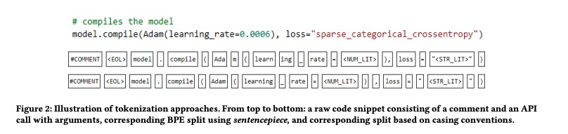
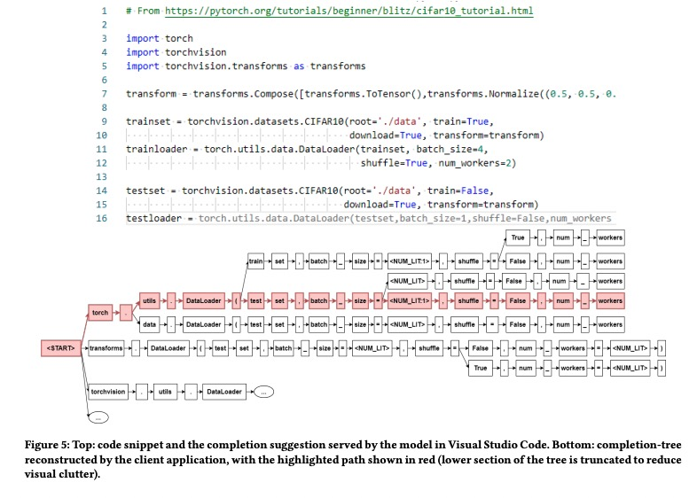
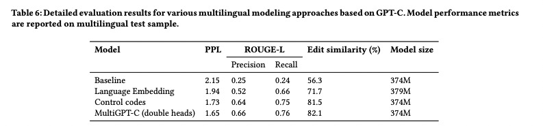

## 《IntelliCode Compose: Code Generation using Transformer》阅读报告


### 研究现状

本文针对代码提示（code completion）进行研究。

1. 现有的系统响应速度较慢，当开发者输入方法名或API时系统才开始运作；
2. 当前的很多系统只关注特定的token形式或特征，而忽略其上下文；

本文提出一个基于GPT-2的代码提示预测架构：GPT-C

### 研究方法

* 以n-gram模型为baseline：
$$P(m | c_0, c_1, ..., c_{n-1})=\frac{N(c_0, c_1, ..., c_{n_1}, m)}{\sum{N(c_0, c_1, ..., c_{n_1})}}$$

* GPT-C基本架构：

输入的上下文token ==> 进过多头自注意力层 ==> 最后positoin-wise feed-forward[1]层输出预测的分布：

$h_0 = W_e \cdot C + W_p$
$h_l = transformer\_block(h_{l-1}), \forall l = 1...n$
$P(m_t)=y_t = softmax(h_n \cdot W_e^T), t = 0...N$

其中，$C = c_{-k}, c_{-k+1}, ... , c_{-1}$是上下文token向量, n为层数，$W_e$为embedding矩阵，$W_p$为position embedding矩阵

* 数据预处理

1. token编码：使用基于BPE（Byte-Pair Encoding）的sentencepiece方法。另外，对每一个代码文件添加特殊token： 开头“\<BOF\>”、结尾“\<EOF\>”；对每一行代码结尾添加“\<EOL\>”；对于Python，必要地方添加缩减标记：“\<INDENT\>”、“<\DEDENT>\”，等等。

2. 对含有敏感信息的数据的处理：将数字表示替换为“\<NUM_LIT\>”，字符串表示替换为“\<STR_LIT\>”，注释替换为“\<COMMENT\>”。特别的对于一些用得很频繁的表示，替换为“\<STR_LIT:lit\>”，其中“lit”为原表示的字面常量

例子：


* 模型训练：使用一种同步的数据并行分布方法（hoho：不懂！）：
```
We scale up the training using synchronous data-parallel distributed training algorithm with local gradient accumulation. 
```
其中使用的一些技巧：
1. 学习率使用warm-up、cosine decay
2. 在解码阶段使用beam search时，把模型上一步计算出来的keys和values缓存起来，作为当前步的输入，避免重复计算


* 客户端处的后处理

调研发现100ms是用户能容忍的延迟上限。为了让这个基于云服务的模型能小于到这种延迟感，使用一种客户端缓存方法：当用户输入非字母和数字时，系统才从服务端的查询代码提示。这种代码提示是一个个带分值权重（score）的token序列，以trie(字典树)[2]形式存储。将这些trie缓存起来，每个提示的缓存的key是这个提示对应的代码片段（应该就是指用户还没输入完的代码片段）。那么，只用用贪心策略遍历这棵树，找到的最大权值的路径就是最终找到的完整的代码提示。

为了防止找到多个相似的结果，还使用一种early-stop策略：如果没有一个子节点的分数大于等于其父结点的分数乘以一个R值，则终止遍历。R的计算方式：$R = \frac{\alpha}{1 + e^{\frac{-L}{k}}}$，其中L为trie中根节点的位置（hoho: 根节点的啥位置？），$\alpha$是一个松弛因子，取值范围$0<\alpha<1$，$\alpha$越小生成的提示长度越长；k用来控制R的增长率，例如取$\alpha=0.8, k=10$可以很好的保持提示长度和相关性的平衡。

另外，生成提示时，还要对之前添加的“\<\BOF>”、“<\EOF>\”等特殊字符进行特殊处理。

生成流程如图：



* 知识蒸馏

参照DistilBERT方法，通过减少transformer block来缩小模型的规模。


### 研究结论

多语言模型的建模

比较了四种建模多语言的方式：
1）忽略语言之间的不同，用统一的模型训练多种语言（实验表明：这种方式比单独对单语言训练效果更差）
2）加入language type embedding信息，每种语言用一个向量表示，和原本的token embedding等结合。
$$h_0 = W_e \cdot C + W_p + W_l \cdot N_{lang}$$
3）在每个训练样本的最开始加上一句"lang * remaining token sequence"
4）在预训练时，加入一个language type classification任务

最终提出了MultiGPT-C。

各种建模对比结果：



### 启示

两种缓存：
1. 缓存transformer的keys和values以节省重复计算
2. 将搜寻结果以树的方式缓存起来

### 附

* 论文地址：[https://arxiv.org/pdf/2005.08025.pdf](https://arxiv.org/pdf/2005.08025.pdf)

[1] positoin-wise feed-forward：其实就是一个MLP，输入与输出维度一样：
    Transformer中的 posstion-wise Feed-Forward Networks，重点就是这个position-wise，区别于普通的全连接网络，这里FFN的输入是序列中每个位置上的元素，而不是整个序列，所以每个元素完全可以独立计算，最极端节省内存的做法是遍历序列，每次只取一个元素得到FFN的结果，但是这样做时间消耗太大，“分段”的含义就是做下折中，将序列分成 段，也就是 个子序列，每次读取一个子序列进行FFN计算，最后将 份的结果拼接。分段FFN只是一种计算上的技巧，计算结果和原始FFN完全一致，所以不会影响到模型效果，好处是不需要一次性将整个序列 读入内存，劣势当然是会增加额外的时间开销了。
[2] trie：一种树，树的节点是一个子字符串，可以通过从根节点向下遍历寻找一个个完整的字符串。