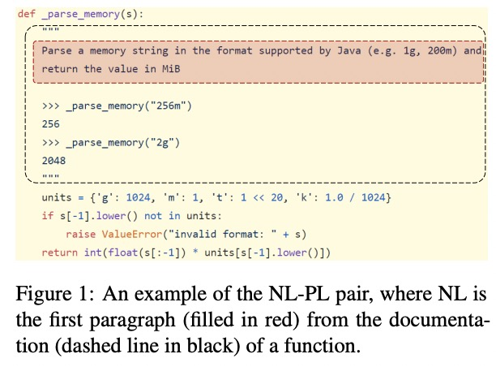
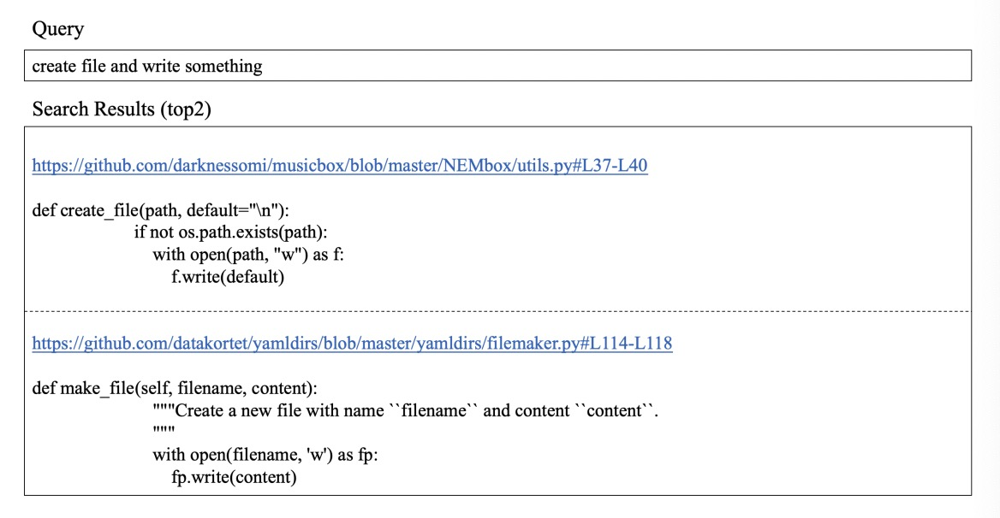
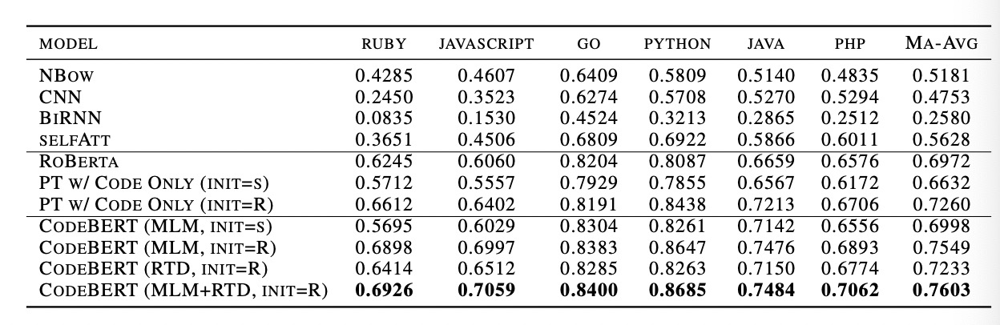
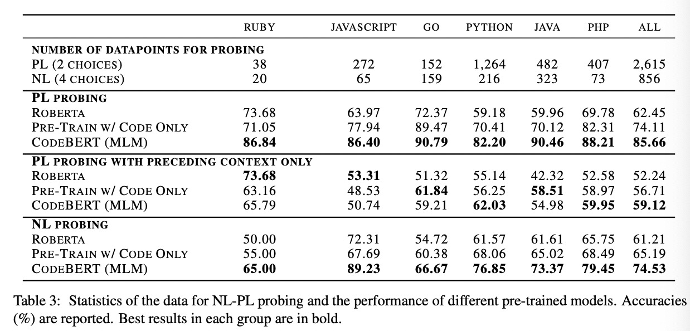
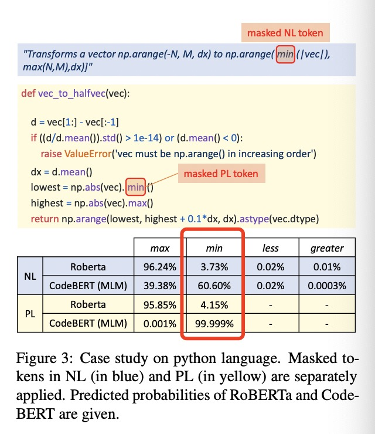
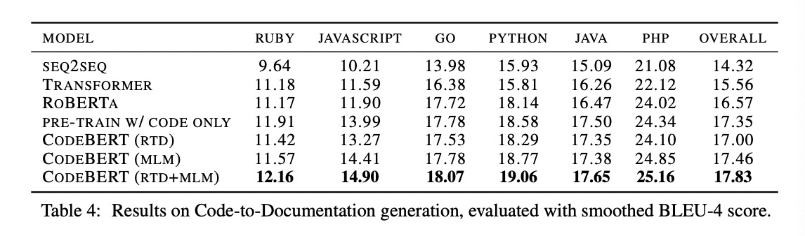
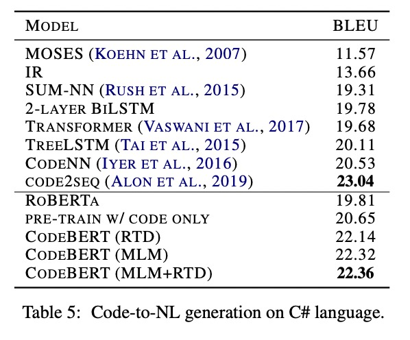

## 《CodeBERT:A Pre-Trained Model for Programming and Natural Languages》阅读报告

### 研究现状

现存各种预训练模型：ELMo、GPT、BERT、XLNet
各种多模态的预训练模型：ViLBERT、VideoBERT

本文认为自然语言NL与编程语言PL也是一种跨模态的领域，提出CodeBERT，该模型能够处理NL-PL的普遍问题，譬如用自然语言搜索代码、自动代码生成等

### 研究方法

* 本文模型仍使用多层双向Transformer框架，与RoBERTa-base相同，模型总参数为125M。

* 在预训练阶段，模型输入为一个NL-PL对：一个是自然语言文本，视为单词的序列，拆分为WordPiece。另一部分为程序代码，看做Token的序列。拼接成Bert要求的方式：[CLS], w1, w2, w3, ..., wn, [SEP], c1, c2, c3, ..., cm, [EOS]（w为自然语言单词，c为程序token）。

例子：

其中红色框为自然语言文本部分。

模型输出包括两部分：
（1）对于自然语言和程序代码的每个Token的有标记的上下文向量（contextual vector）
（2）聚合序列表示（[CLS]对应的向量）

* 在模型训练的设计上，包括两个目标：

(1) 掩码语言模型（Masked Language Modeling, MLM）。将NL-PL对作为输入，随机为NL和PL选择位置进行掩码，然后用特殊的掩码Token进行替换。注意，掩码语言建模的任务是预测出被掩码的原始Token。其损失函数为：

$$L_{MLM}(\theta) = \sum_{i\epsilon m^w \cup m^c }^{} -logP^{D_1}(x_i | w^{masked}, c^{masked})$$

其中$m^w$和$m^c$是被mask掉的位置.

(2) 替换Token检测（Replaced Token Detection, RTD）。在这部分有两个数据生成器，分别是NL生成器和PL生成器，这两个生成器都用于随机掩码位置集（randomly masked positions）生成合理的备选方案。另外，还有一个学习生成器用来检测一个词是否为原词，其背后原理是一个二分类器，这里与GAN不同的是，如果生成器碰巧产生正确的Token，则该Token的标签是“real”而不是“fake”。损失函数为：

$$L_{RTD}(\theta)=\sum_{i=1}^{|w| + |c|}(\delta(i)logp^{D_2}(x^{corrupt}, i) + (1 - \delta(i))(1 - logp^{D_2}(x^{corrupt}, i)) )$$

$$
\delta(i) = \begin{cases}
1 & ,\text{ if } x_i^{corrupt}=x_i \\
0 & ,\text{ if } otherwise 
\end{cases}
$$

那么，总的损失函数为：

$$\underset{\theta }{min}L_{MLML}(\theta ) + L_{RTD}(\theta )$$

* 模型的微调：例如在自然语言代码搜索中，会使用与预训练阶段相同的输入方式，并且使用[CLS]的表示向量来衡量代码跟自然语言直接的相关性。

而在代码到文本的生成中，使用编码器-解码器框架，并使用CodeBERT初始化生成模型的编码器。

### 研究结论

本文作者做了四个实验：

（1）将CodeBERT应用到自然语言代码搜索任务上，并与传统方法进行对比。

给定一段自然语言作为输入，代码搜索的目标是从一组代码中找到语义上最相关的代码，如：

各模型的MRR(Mean Reciprocal Rank)对比如下：

（2）进行NL-PL Probing实验，考察CodeBERT在预训练阶段到底学习了什么知识。

这部分实验主要研究在不更改参数的的情况下，Code BERT能够学习哪些类型的知识。目前学界还没有针对NL-PLProbing的工作，所以在这部分实验中，作者自行创建了数据集。

给定NL-PL对，NL-PL Probing的目标是测试模型的正确预测能力。模型精确度(正确预测实例的数量与全部实例数量的比例)比较结果如下：

也可以用一个具体的案例来对比下。下图案例中分别掩盖了NL和PL中的“min”:

对比RoBerta与CodeBert预测该位置为“min”的精确率有显著提升：

（3）将CodeBERT应用到生成任务当中。

这部分研究代码到文档的生成问题，并在六种编程语言中对比了生成任务在CodeSearchNet数据集上的结果。作者采用了各种预训练的模型作为编码器，并保持了超参数的一致性。各模型的BLEU-4分属于如下：

（4）考察CodeBERT预训练模型的泛化能力。

本文的CodeBert只在Python、JavaScript、Java、Ruby、PHP、Go这些语言上做预训练，而本实验的在C#语言上（不是上面6中预训练用的编程语言）进行摘要生成，BLEU-4分数如下：

说明CodeBERT能够更好地推广到其他编程语言。但模型的效果略低于code2seq，作者认为原因可能是code2seq融入了抽象语法树AST中的表示，而CodeBERT仅将原始代码作为输入，所以CodeBERT在组合AST的语义上还有待研究。

### 附：

* 关于Zero-shot：zero show learning就是希望我们的模型能够对其从没见过的类别进行分类，让机器具有推理能力，实现真正的智能。其中零次（Zero-shot）是指对于要分类的类别对象，一次也不学习。

* 论文地址：[https://arxiv.org/pdf/2002.08155.pdf](https://arxiv.org/pdf/2002.08155.pdf)

* 代码：[https://github.com/microsoft/CodeBERT](https://github.com/microsoft/CodeBERT)

* 数据集：[CodeSearchNet](https://arxiv.org/pdf/1909.09436.pdf)