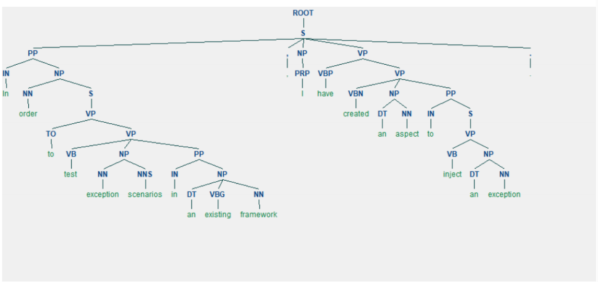

## 《基于信息检索的软件多特征缺陷定位方法研究》阅读报告

### 研究现状

目前缺陷定位方法大致有两个主流方向：
* 基于程序频谱（Sepctrum Based Fault Localization, SBFL），着重于程序执行，依赖分析程序的动态执行信息和成功/失败的测试用例执行轨迹，对它们进行统计计算，从而进行缺陷定位

* 基于信息检索（Information Retrieval Based Bug Localization, IRBL），通过从给定的缺陷报告和项目的源代码来提取重要特征，计算特征之间的潜在相似度并对源代码进行排名，从而获得于缺陷报告描述的缺陷疑似匹配的前几个源代码文件

但动态缺陷定位方法（主要指SBFL）在大型软件维护过程中，开发人员总不能获得足够的测试用例和测试结果，仅能获得用户或测试人员提供的缺陷报告

而静态缺陷定位（IRBL）存在三点不足：

1. 对缺陷报告查询项的查询重构研究不足（噪声比较多）；
2. 特征考虑不充分；
3. 只着眼于文档间的表面文本相似性，这往往缺乏了对文本与代码的潜在语义进行特征表示。

本文分三章分别对应以上三点不足，阐述相应解决方案。

### 研究方法

* IRBL的总体流程

1. 将缺陷报告作分词处理，把预处理之后的缺陷报告看作是查询项Query
2. 将软件开发项目中的所有源代码文件简历一个语料库Documents，将其看作是被查询的所有文档项
3. 当用户或测试人员提交缺陷报告时，进行一次检索工作：提取并计算缺陷报告和源代码的相关特征，通过自然语言领域算法处理，得到报告和源代码直接的相关度，按照相关度排名，越靠前排名的源代码，越有可能包含缺陷

#### 对缺陷报告重构研究不足的改进

当前，用户提交的缺陷报告内容与开发者希望收到的信息之间不匹配，软件开发者需要的信息是缺陷报告中的堆栈信息和测试用例信息等测试过程中收集的信息，而用户很难提供这些信息

* 对缺陷报告的分类：
1. 富查询： 包含程序元素（类名、方法名、变量名）
2. 噪声查询： 包含堆栈跟踪信息
3. 不良查询： 只有自然语言描述

本文主要针对该类缺陷报告，采用自动查询重构的方式提高查询质量。

主要有三种方法：
1. 如果报告带有文本附件，提前其中的文本信息，对缺陷报告desciption字段进行扩展，使不良查询转变为富查询、噪声查询
2. 基于启发式规则的动宾短语过滤：从“summary”和“description”部分提取动宾短语（VP字段），这是最能表征缺陷报告的文本片段：
 2.1 进行句法分析，提取动宾短语。本文使用Stanford CoreNLP库（字符串格式）和python的NLTK的Tree类，提前的句法分析树：
 
 2.2 对动宾短语进行过滤：指定过滤规则，然后设置阈值，针对每一个VP，若该字段满足设定的规则，则在分数上加上规则设置的分数，若不满足，则在已有分数上减去规则设置的分数。本文使用规则如下：
    a. 基于动词-名词规则：对不包含动词或名词的VP，直接设置评分为0，直接删减掉
    b. 基于扩展停用词表的规则。
        （1）常规的停用词表含有：“a”、“the”、“an”等词，作者将情感语气词如“can”、“could”、“may”、“must”也加入停用词表，因为撰写人员的心情与源代码实现的功能无关。
        （2）在VP的动词位置上停用词表的情感动词，直接将该VP分数置为0，直接删掉；若非动词位置上出现情感动词，该VP评分减1分
        （3）在VP的名词位置上是代词且该单词起主要作用，则将该VP评分将为0，直接删掉；若名词位置包含代码但该单词没起主要作用（hoho:如何判定是否起主要作用），则减2分；若VP非名词位置包含代词，则减1分
例子：对于语句：“In order to test exception scenarios in an existing framework, I havecreated an aspect to inject an execption”提取到如下两个VP：“test exception scenarios”和“created an aspect to inject an exception”
3. 候选词提取：使用伪相关反馈提取。
（什么是相关性反馈Relevance Feedback：在搜索过程中，在简单制定一个查询后，如果尝试发现初始查询结果不尽人意，则可以通过与搜索引擎进行明确的查询一相应会话，或更自动的通过分析为初始查询检索到的文档以寻找方法来完善原始查询，扩充它以供进一步检索）

如显式相关反馈，过程如下：
（1）用户提交查询；
（2）检索系统针对查询需求进行计算，并返回第一次检索结果给用户；
（3）当看到搜索引擎返回的第一组检索结果后，用户通过标记相关和不相关
的结果集来明确提供自己的判断；
（4）系统通过用户反馈重新计算查询并向用户提供一组新的检索结果。 
（5）重复 2-4 过程，直到找到所有目标文件。
但这种查询会延长会话时间，且需要人工参与，不适用。

本文使用的伪相关反馈为：不需要用户重复简历查询，在获得第一组检索结果后，将前X个检索到的文档集D视为相关文档集的近似值，并选择这些文档中的“最佳”词项来重新编制查询。在寻找“最佳”词项过程中，需要通过计算对文档词项权重来对词项进行排序，本文使用tf-idf加权方法计算。如果D中的文件获得最高的检索分数，因此它们很可能包含在概念上与原始查询相关的其他信息术语。

### 研究结论

#### 对缺陷报告重构研究不足的改进

（to be continue...）