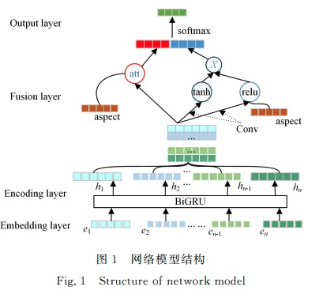
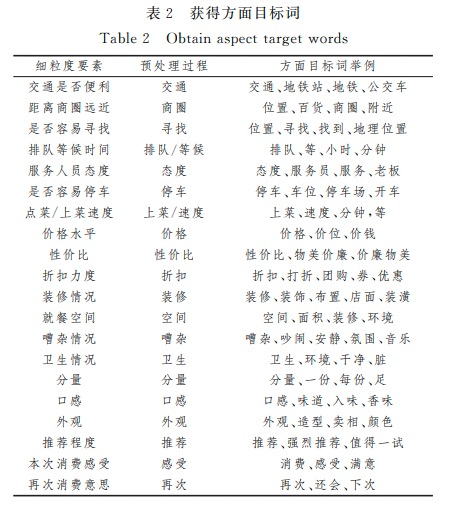

### 研究方法

总体模型结构：

1. 数据集：句子、方面词、情感极性三元组<S, A, C>，
* S = {w1, w2, ..., wn}表示由n个词wi组成的句子，
* A = {a1, a2, ..., at}表示事先定义好aspect-category共有t个
* C = {-2, -1, 0, 1}表示情感极性，-2表示未提及，-1表示负向，0表示中性，1表示正向

2. 输入：字词联合的嵌入

将每个词中的每个字映射为向量，每个词也映射为向量，将字向量和词向量进行匹配，通过Bi-GRU获得各个词语的字向量，然后进行最大池化操作，最后通过拼接将字向量和词向量联合起来

$$c_i = BiGRU(s_i)$$
$$e^c_i = [max(c_1), ..., max(c_{2d_h})] $$
$$e_i = [e^w_i;e^c_i]$$

3. 方面词嵌入

计算方面词与方面目标词的相似度，保留高质量的方面目标词，选出最终方面词信息。

### 附

* 哈尔滨工业大学预处理工具LTP
* 知网情感分析用词语集 HOWNET
* 数据集 AIchallenger2018